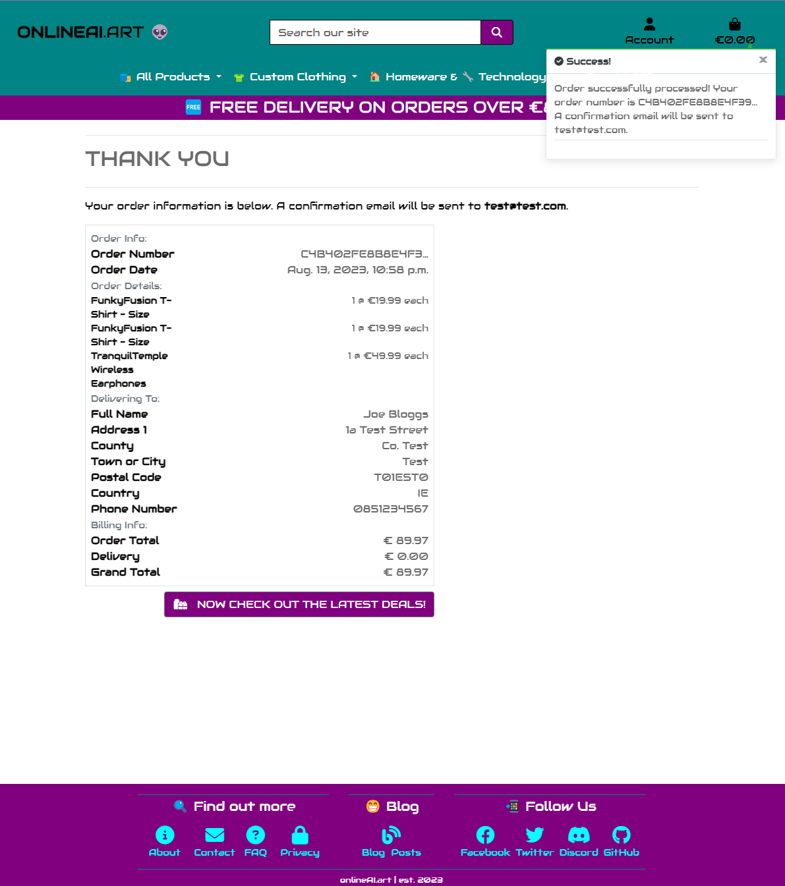
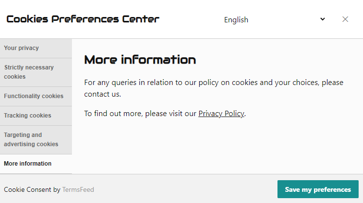
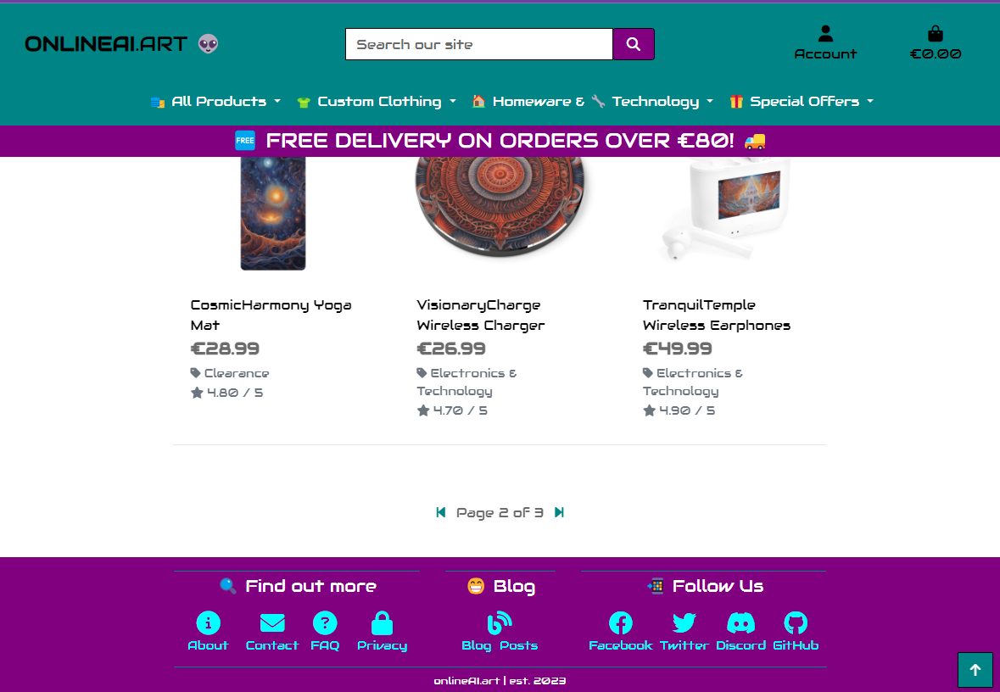
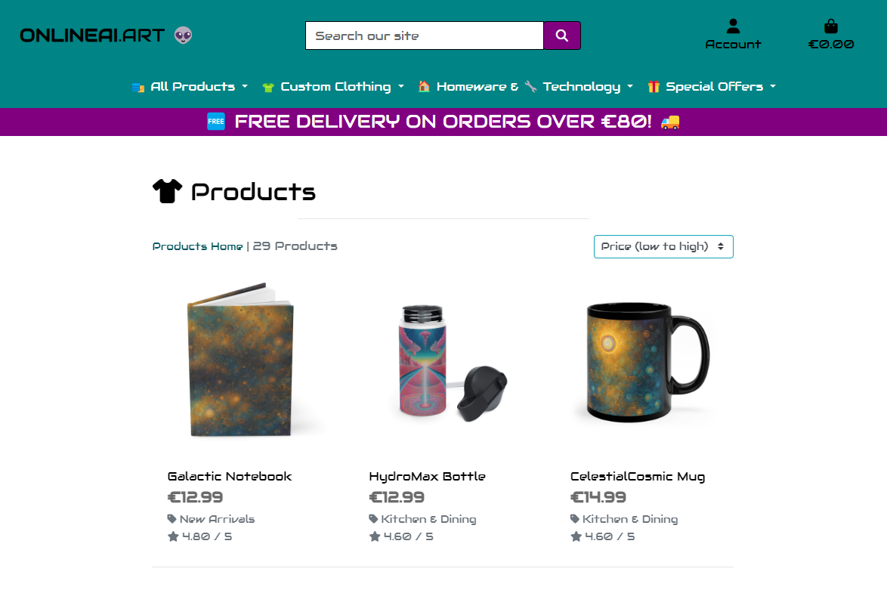
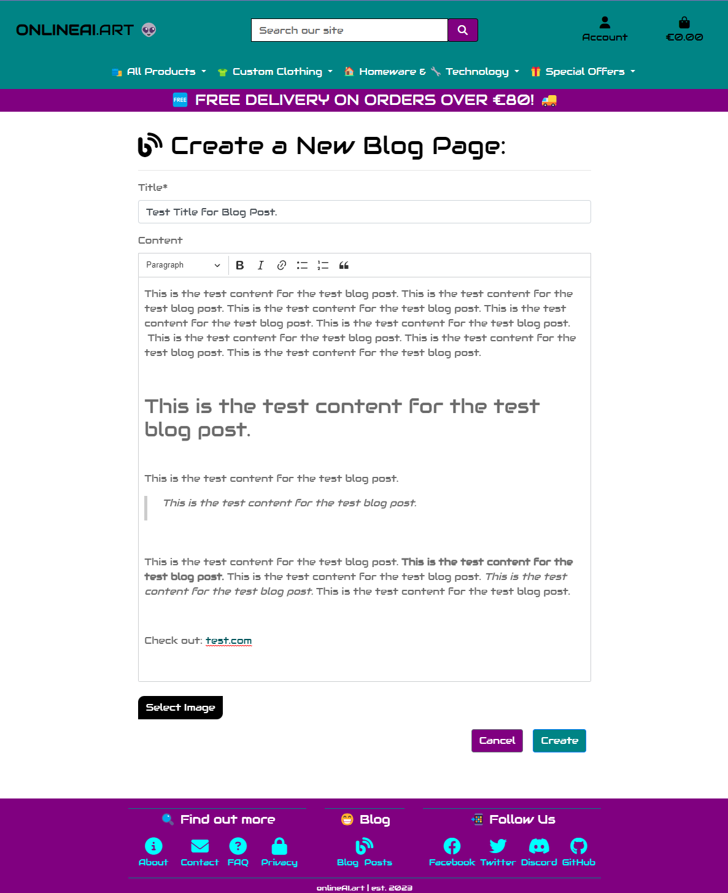
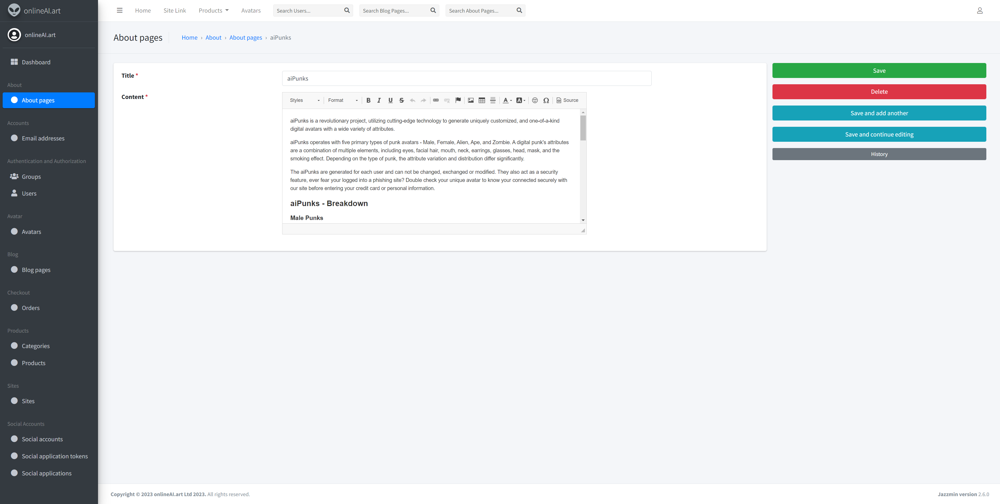
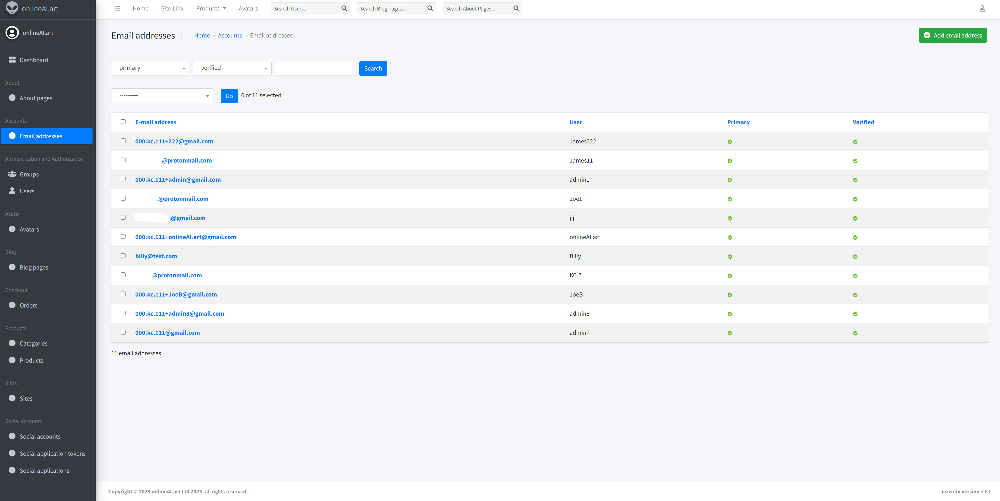
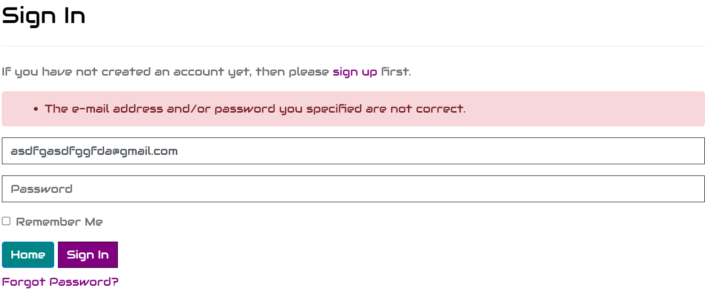
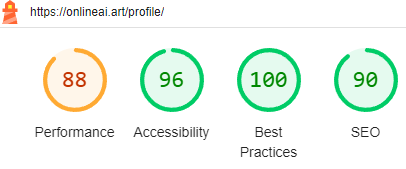

# onlineAI.art | E-Commerce Project

## Live Links

[👉 onlineAI.art 👈](https://onlineai.art/)

[onlineAI.art - Admin Portal](https://onlineai.art/admin/)

[Heroku App Link](https://kc-ecommerce-434e6f88dca9.herokuapp.com/)

[Facebook Page](https://www.facebook.com/people/Onlineaiart/61550214234067/)

---


## Project Preview 

### Project Description

This is a project for an E-Commerce Store which specializes in offering custom printed products, each designed uniquely using AI image generative technology. An agile approach was taken and the project was created using Django and Bootstrap.

### Main Site - User Preview


The platform is a robust, web-based application e-commerce application developed using the Django framework. This platform provides users with a seamless shopping experience, from product browsing to secure checkout. Admin features offer comprehensive management tools for products, blogs, and other site content. Integrated with Stripe for payment processing and AWS S3 for static and media file hosting, the platform is scalable and optimized for performance. An Algorithmically Generated Pixel Art Avatar is generated for each new user. This platform is designed to be intuitive for users while providing developers with a clean and modular codebase for further enhancements. Regular and [detailed git commits](https://github.com/KC-7/ecommerce/commits/main) have been used for version control.

### Main Site - Admin Preview


Admin users can create, modify or delete the about pages, blog posts and products. They can also access a custom admin portal for additional admin functionality.

### Admin Portal Preview


---


## Technologies and Services

| Technology / Service | Description                                                                                                                               |
|-------------------|----------------------------------------------------------------------------------------------------------------------------------------------|
| Django            | A high-level Python Web Framework that encourages rapid design and clean, pragmatic design.                                                  |
| Python            | A versatile, high-level programming language used for web development and various other applications.                                        |
| HTML              | The standard markup language used for structuring web content.                                                                               |
| CSS               | A stylesheet language used for describing the look and formatting of a document written in HTML.                                             |
| JavaScript        | A programming language that enables interactive web pages and is a part of most web browsers.                                                |
| AWS (Amazon Web Services) | A subsidiary of Amazon providing on-demand cloud computing platforms and APIs.                                                       |
| ElephantSQL       | A fully managed PostgreSQL database hosting service with automated backups, scaling, and high availability.                                  |
| Stripe            | An online payment processing platform that supports online money transfers.                                                                  |
| Git               | A distributed version control system used to track changes in any set of files.                                                              |
| GitHub            | A platform that provides hosting for software development and a community of developers to discover, share, and build better software.       |
| GitPod            | An online integrated development environment for GitHub. It provides a complete dev environment, enabling you to start coding immediately.   |
| Cloudflare        | A web performance and security company that provides online services to protect and accelerate websites online.                              |
| NameCheap         | An ICANN-accredited domain name registrar, which provides domain name registration and web hosting.                                          |
| Bootstrap         | A free and open-source CSS framework used for responsive, mobile-first front-end web development.                                            |
| CKEditor          | A popular WYSIWYG editor that brings common word processor features directly to web pages.                                                   |
| Jazzmin           | A fresh lick of paint for the Django admin interface.                                                                                        |

---


## Table of Contents

- [onlineAI.art | E-Commerce Project](#onlineaiart---e-commerce-project)
  * [Live Links](#live-links)
  * [Project Preview](#project-preview)
    + [Project Description](#project-description)
    + [Main Site - User Preview](#main-site---user-preview)
    + [Main Site - Admin Preview](#main-site---admin-preview)
    + [Admin Portal Preview](#admin-portal-preview)
  * [Technologies and Services](#technologies-and-services)
  * [Table of Contents](#table-of-contents)
  * [Business Overview](#business-overview)
    + [Purpose of Website](#purpose-of-website)
    + [Business Type](#business-type)
    + [Target Audience](#target-audience)
    + [Primary Marketing Strategy](#primary-marketing-strategy)
    + [Marketing Solutions to Meet Audience Needs](#marketing-solutions-to-meet-audience-needs)
  * [User Story Test Cases](#user-story-test-cases)
      - [View and Navigation](#view-and-navigation)
      - [Registration and User Accounts](#registration-and-user-accounts)
      - [Sorting and Searching](#sorting-and-searching)
      - [Purchasing and Checkout](#purchasing-and-checkout)
      - [Admin and Store Management](#admin-and-store-management)
      - [Additional Features](#additional-features)
    + [Agile User Stories Board](#agile-user-stories-board)
  * [Design](#design)
    + [Colour Scheme](#colour-scheme)
    + [Typography](#typography)
    + [Wireframes](#wireframes)
    + [Desktop Wireframes](#desktop-wireframes)
    + [Mobile Wireframes](#mobile-wireframes)
    + [Data Schema](#data-schema)
      - [User](#user)
      - [UserProfile](#userprofile)
      - [Category](#category)
      - [Product](#product)
      - [Order](#order)
      - [OrderLineItem](#orderlineitem)
      - [BlogPage](#blogpage)
      - [AboutPage](#aboutpage)
      - [Avatar](#avatar)
    + [Bag](#bag)
    + [BagItem](#bagitem)
    + [Payment](#payment)
    + [Entity Relationships](#entity-relationships)
    + [Entity Relationship Diagram](#entity-relationship-diagram)
  * [Site Features](#site-features)
    + [Custom Admin Portal](#custom-admin-portal)
    + [Custom Admin Features](#custom-admin-features)
    + [E-commerce functionality](#e-commerce-functionality)
      - [Stripe Integration & Test Card Details](#stripe-integration---test-card-details)
    + [CKEditor](#ckeditor)
      - [Set Up Guide](#set-up-guide)
    + [Custom About Pages (CRUD)](#custom-about-pages--crud-)
      - [Project Conception](#project-conception)
      - [Usability](#usability)
    + [CRUD Operations](#crud-operations)
      - [Custom Editor](#custom-editor)
    + [Custom Blog Posts with CRUD](#custom-blog-posts-with-crud)
      - [Project Conception](#project-conception-1)
      - [Usability](#usability-1)
    + [CRUD Operations](#crud-operations-1)
      - [Custom Editor](#custom-editor-1)
    + [Algorithmically Generated Pixel Art Avatars](#algorithmically-generated-pixel-art-avatars)
      - [What are CryptoPunks?](#what-are-cryptopunks-)
      - [Project Conception and Implementation](#project-conception-and-implementation)
      - [Development and Research Process](#development-and-research-process)
      - [Leveraging Existing Work](#leveraging-existing-work)
      - [Customization and Integration](#customization-and-integration)
      - [Administrative Enchancement](#administrative-enchancement)
    + [User Feedback, Error Handeling and 404 Redirection](#user-feedback--error-handeling-and-404-redirection)
  * [Dependencies & Their Use Cases](#dependencies---their-use-cases)
  * [Deployment & Local Development](#deployment---local-development)
    + [Deployment](#deployment)
      - [Create the Live Database](#create-the-live-database)
      - [Heroku App Setup](#heroku-app-setup)
      - [Preparation for Deployment in GitPod](#preparation-for-deployment-in-gitpod)
      - [Generate a SECRET KEY & Updating Debug](#generate-a-secret-key---updating-debug)
      - [Set up AWS hosting for static and media files](#set-up-aws-hosting-for-static-and-media-files)
      - [Creating AWS groups, policies and users](#creating-aws-groups--policies-and-users)
      - [Connecting Django to our S3 bucket](#connecting-django-to-our-s3-bucket)
      - [Setting up Stripe](#setting-up-stripe)
    + [Local Development](#local-development)
      - [How to Fork](#how-to-fork)
      - [How to Clone](#how-to-clone)
    + [Environment Variables](#environment-variables)
  * [Custom Domain & SSL Cert](#custom-domain---ssl-cert)
    + [Custom Domain Set Up on Namecheap](#custom-domain-set-up-on-namecheap)
    + [SSL Cert & HTTPS Redirection Set Up on Cloudflare](#ssl-cert---https-redirection-set-up-on-cloudflare)
    + [Cloudflare Security](#cloudflare-security)
  * [Product Creation Process](#product-creation-process)
    + [AI Images usign ComfyUI with Stable Diffusion XL](#ai-images-usign-comfyui-with-stable-diffusion-xl)
      - [Setup Guide for Comfy UI with SDXL 1.0 base and refiner models](#setup-guide-for-comfy-ui-with-sdxl-10-base-and-refiner-models)
    + [Custom Product using Printify](#custom-product-using-printify)
    + [Product Descriptions using ChatGPT](#product-descriptions-using-chatgpt)
    + [Custom Products Fixtures](#custom-products-fixtures)
  * [Web Marketing & Search Engine Optimization (SEO)](#web-marketing---search-engine-optimization--seo-)
    + [Facebook Page](#facebook-page)
    + [Mailchimp Newsletter](#mailchimp-newsletter)
    + [Google Search Console](#google-search-console)
    + [Google Business](#google-business)
    + [Google Analytics](#google-analytics)
    + [GDPR](#gdpr)
  * [Automated, Manual & Validation Testing](#automated--manual---validation-testing)
    + [Manual Testing](#manual-testing)
      - [User Tests](#user-tests)
      - [Admin Tests](#admin-tests)
      - [Admin Portal Tests](#admin-portal-tests)
      - [Additional Tests](#additional-tests)
    + [Automated Testing](#automated-testing)
      - [Coverage Installation](#coverage-installation)
      - [Run Django tests with coverage](#run-django-tests-with-coverage)
      - [Generate Coverage Report](#generate-coverage-report)
      - [Run All Tests](#run-all-tests)
      - [Results for Automated Tests](#results-for-automated-tests)
      - [Coverage Report](#coverage-report)
    + [Lighthouse Testing](#lighthouse-testing)
    + [Console Log Testing](#console-log-testing)
    + [W3 Nu HTML Checker Testing](#w3-nu-html-checker-testing)
    + [W3C Jigsaw CSS Validation Testing](#w3c-jigsaw-css-validation-testing)
    + [JSHint JS Testing](#jshint-js-testing)
    + [Flake8 Python Testing](#flake8-python-testing)
      - [Results](#results)
    + [Responsiveness Testing](#responsiveness-testing)
      - [Visual Testing on Physical Devices](#visual-testing-on-physical-devices)
      - [Visual Testing using Google Inspect](#visual-testing-using-google-inspect)
      - [Visual Testing using AmIRepsponsive](#visual-testing-using-amirepsponsive)
  * [Bugs & Issues](#bugs---issues)
    + [Allauth Templates Directory Not Found](#allauth-templates-directory-not-found)
    + [Heroku Invalid Credentials Provided](#heroku-invalid-credentials-provided)
    + [Issue while Initializing the Heroku Git Remote](#issue-while-initializing-the-heroku-git-remote)
    + [Programmatic Access for AWS User](#programmatic-access-for-aws-user)
    + [Navbar too large](#navbar-too-large)
    + [Order number too long](#order-number-too-long)
    + [Navbar not displayed correctly on Profile](#navbar-not-displayed-correctly-on-profile)
    + [Images sizes too large](#images-sizes-too-large)
    + [Custom CKEditor not responding well on small mobile devices](#custom-ckeditor-not-responding-well-on-small-mobile-devices)
    + [Unable to view saved embeded HTML with CKEditor](#unable-to-view-saved-embeded-html-with-ckeditor)
    + [Back to top button not crawlable](#back-to-top-button-not-crawlable)
    + [Access Restricted Message on GitHub when Accessing Repo Anonymously](#access-restricted-message-on-github-when-accessing-repo-anonymously)
  * [Future Development](#future-development)
  * [Learning Goals](#learning-goals)
    + [Learning Goals 1: Integrate an e-commerce payment system and product structure in a cloud-hosted Full-Stack web application](#learning-goals-1--integrate-an-e-commerce-payment-system-and-product-structure-in-a-cloud-hosted-full-stack-web-application)
    + [Learning Goals 2: Employ advanced User Experience Design to build a commercial-grade Full Stack Web Application](#learning-goals-2--employ-advanced-user-experience-design-to-build-a-commercial-grade-full-stack-web-application)
    + [Learning Goals 3: Employ Search Engine Optimisation (SEO) techniques to improve audience reach](#learning-goals-3--employ-search-engine-optimisation--seo--techniques-to-improve-audience-reach)
    + [Learning Goals 4: Create a secure Full Stack Web application with Authentication and role-based Authorization functionality](#learning-goals-4--create-a-secure-full-stack-web-application-with-authentication-and-role-based-authorization-functionality)
    + [Learning Goals 5: Employ marketing techniques to create brand reach](#learning-goals-5--employ-marketing-techniques-to-create-brand-reach)
    + [Learning Goals 6: Understand the fundamentals of E-commerce applications](#learning-goals-6--understand-the-fundamentals-of-e-commerce-applications)
    + [Learning Goals 7: Additional Learning Outcomes (M)](#learning-goals-7--additional-learning-outcomes--m-)
    + [Learning Outcome 8: Additional Learning Outcomes (D)](#learning-outcome-8--additional-learning-outcomes--d-)
  * [Resources & Credits](#resources---credits)
    + [Useful Links & Resources](#useful-links---resources)
    + [Credits & Special Thanks](#credits---special-thanks)
  * [Conclusion & Contact](#conclusion---contact)

---


## Business Overview

<details open>

<summary><b>Click here to minimize this section ➖ ⬆️</b></summary>

### Purpose of Website

The purpose of the website is a robust e-commerce platform that meets the needs of its potential customers. The site is designed to sell products with custom printed AI artwork such as clothing, homeware and tech products.

### Business Type

The site primarily uses a B2C (business to consumer) business model. The site caters directly to consumers and is designed to be easy to interact and allow for swift checkout without the need for user registration. This allows for potential customers to make a purchase as quickly and as easily as possible. Return customers can set up an account which allows them to save their delivery information to simply the checkout process even further.

### Target Audience

The target audience is multi-faceted and includes but is not limited to the below consumer types. We envisage our target audience will be both male and female, mainly ranging from 18 to 60 years old. 

- **Tech Enthusiasts:** Indviduals interested in AI technology and generative art
- **Design and Art Enthusiasts:** Individuals interested in art and design
- **E-Commerce Shoppers:** Regular online shoppers looking for unique products

### Primary Marketing Strategy

The primary marketing strategy is to leverage the uniqueness of the product range, our products are not available anywhere else as they are custom designed for the store. Our unique products range will attract general E-Commerce Shoppers, our custom designs will attract Art Enthusiasts and our tech related blog posts will attract Tech Enthusiasts. 

### Marketing Solutions to Meet Audience Needs

Alongside our primary marketing strategies we will implement additional marketing solutions to meet the needs of our target audience:

- **Social Media:** A dedicated [Facebook Business Page](https://www.facebook.com/people/Onlineaiart/61550214234067/) has been created to showcase our unique designs and products. We will also create Twitter and Instagram pages to expand our out reach on different platforms. Alongside this we can set up a Discord channel to create a social community. We will also be able to share our custom images and products on additional platforms such as Reddit, TikTok, etc.
- **Engaging Content:** We intend to utilize the Blog and About applications on the website to create engaging content about generative art and AI technology which will improve user engagement on the site.
- **Email newsletter:** We have set up a newsletter using MailChimp so we can send free, regular newsletters to our subscribers.
- **Affiliant Marketing:** We intend to utilize the blog platform for affiliate marketing for non-competing products such as generative AI services etc. 
- **Collaborations:** We intend to collaborate with influencers in the tech and fashion industries to showcase our products.
- **Promotions and Discounts:** We have implemented a clearance and sale section on the site. We will also send discounts to our newsletter subscribers in future.
- **Advertising & SEO:** Monitor our analytics using Google Analytics and monitor search results with Google Search Console. Potentially set up Google Business and Google Advertising in future to attract additional customers.

[Click here to go back up to the Table of Contents 📗 ⤴️](#table-of-contents)

</details>

---


## User Story Test Cases

[Click here to see the Github User Stories Board](#)

<details open>

<summary><b>Click here to minimize this section ➖ ⬆️</b></summary>

#### Epic: View and Navigation
1. As a Shopper, I want to be able to view a list of products so that I can select some to purchase.
2. As a Shopper, I want to be able to view a list of products so that I can quickly find products I'm interested in without having to filter through all products.
3. As a Shopper, I want to be able to view individual product details so that I can identify the price, description, product rating, product image, and available sizes.
4. As a Shopper, I want to be able to quickly identify deals, clearance items, and special offers so that I can take advantage of special savings on products I'd like to purchase.
5. As a Shopper, I want to be able to easily view the total of my purchases at any time so that I can avoid spending too much.

#### Epic: Registration and User Accounts
6. As a Site User, I want to be able to easily register for an account so that I can have a personal account and be able to view my profile.
7. As a Site User, I want to be able to easily login and logout so that I can access my personal account information.
8. As a Site User, I want to be able to easily recover my password in case I forget it so that I can recover access to my account.
9. As a Site User, I want to be able to receive an email confirmation after registering so that I can verify that my account registration was successful.
10. As a Site User, I want to be able to have a personalized user profile so that I can view my personal order history and confirmations, and save my payment information.

#### Sorting and Searching
11. As a Shopper, I want to be able to sort the list of available products so that I can easily identify the best rated, best priced, and categorically sorted products.
12. As a Shopper, I want to be able to sort a specific category of product so that I can find the best priced or best rated product in a specific category, or sort the products in that category by name.
13. As a Shopper, I want to be able to sort multiple categories of products simultaneously so that I can find the best priced or best rated products across broad categories, such as "clothing" or "homeware".
14. As a Shopper, I want to be able to search for a product by name or description so that I can find a specific product I'd like to purchase.
15. As a Shopper, I want to be able to easily see what I've searched for and the number of the results so that I can quickly decide whether the product I want is available.

#### Purchasing and Checkout
16. As a Shopper, I want to be able to easily select the size and the quantity of a product when purchasing it so that I can ensure I don't accidentally select the wrong product quantity or size.
17. As a Shopper, I want to be able to view items in my bag to be purchased so that I can identify the total cost of my purchase and all of the items I will receive.
18. As a Shopper, I want to be able to adjust the quantity of individual items in my bag so that I can easily make changes to my purchase before checkout.
19. As a Shopper, I want to be able to easily enter my payment information so that I can check out quickly and without issues.
20. As a Shopper, I want to be able to feel that my personal and payment information is safe and secure so that I can confidently provide the needed information to make a purchase.
21. As a Shopper, I want to be able to view an order confirmation after checkout so that I can verify that I haven't made any mistakes.
22. As a Shopper, I want to be able to receive an email confirmation after checking out so that I can keep the confirmation of what I've purchased for my records.

#### Admin and Store Management
23. As a Store Owner, I want to be able to add a product so that I can add new items to my store.
24. As a Store Owner, I want to be able to edit/update a product so that I can change product prices, descriptions, images, and other product criteria.
25. As a Store Owner, I want to be able to delete a product so that I can remove items that are no longer for sale.

#### Additional Features
26. As a Site User, I want to be able to sign up for a mailing list so that I can stay up to date with the latest products and deals.
27. As a Site User, I want to be able to find out more information so that I can find out additional information about the company such as shipping, etc.
28. As a Store Owner, I want to be able to be able to easily add, edit, or delete the about pages so that I can ensure customers are kept up to date with the latest, most accurate information about our business.
29. As a Store Owner, I want to set up a blog so that I can draw more site attention, recommend my products to the target audience, and potentially affiliate marketing and sponsored articles.
30. As a Store Owner, I want to be able to easily add, edit and delete blog posts, so that I can easily share new posts and maintain exisiting ones.
31. As a Store Owner, I want create a unique custom avatar with unique traits for each user so that I can enhance the personalized shopping experience to create increased customer engagement and retention.
32. As a Store Owner, I want to customize the admin panel to ensure its clean and user friendly so that the admin team can easily access the relevant data and make necessary changes as required.
33. As a Store Owner, I want to be able to make a limited amount of non intrusive styling changes to blog posts and about pages without the need for a web developer so that I can make my about pages and blog articles visually appealing for the users.

### Agile User Stories Board


I initially tracked all of my user stories on excel tracker spreadsheet but updated them onto the Agile board.

A [project board was set up on GitHub](https://github.com/users/KC-7/projects/5) to display the user stories.

The Agile board is publicly accessible and linked to the "ecommerce" repository for this project. 

A custom templates was set up for the user stories.

A custom label was set up to add stories as features. 

Thirty three user stories were added to the board and closed post completion.

The user stories were carried out in sprints to build the website.

Six milestones where set up for the project and closed off after completion.


[Click here to go back up to the Table of Contents 📗 ⤴️](#table-of-contents)

</details>

---


## Design

<details open>

<summary><b>Click here to minimize this section ➖ ⬆️</b></summary>

### Colour Scheme

The below custom colour scheme was designed and set up for the site. 

    :root {
        /* Electric Pink */
        --pink: #ffa0ff;
        /* Cosmic Cyan */
        --cyan: #00FFFF;
        /* Mystical Purple */
        --purple: #800080;
        /* Transcendent Teal */
        --teal: #008080;
        /* Divine Gold */
        --gold: #FFD700;
        /* Energetic Orange */
        --orange: #FFA500;
        /* Onyx Black */
        --black: #000000;
        /* Gun Metal Grey */
        --grey: #808080;
        /* Silver Blush */
        --silver: #dddddd;
        /* Pearl White */
        --white: #FFFFFF;
    }


### Typography

The font Audiowide has been used throughout the site to give it a modern, futuristic feel. This was imported into the CSS file from the main base template using [Google Fonts](https://fonts.google.com/).

</summary> 

[Click here to go back up to the Table of Contents 📗 ⤴️](#table-of-contents)

### Wireframes

I created the wireframes for the Home, Products and Product Page using [Figma](https://www.figma.com/).

### Desktop Wireframes


### Mobile Wireframes


### Data Schema

#### User
- `id`: Integer (Primary Key)
- `password`: Varchar
- `last_login`: Datetime
- `is_superuser`: Boolean
- `username`: Varchar
- `first_name`: Varchar
- `last_name`: Varchar
- `email`: Varchar
- `is_staff`: Boolean
- `is_active`: Boolean
- `date_joined`: Datetime

#### UserProfile
- `id`: Integer (Primary Key)
- `user_id`: Integer (Foreign Key to User)
- `default_phone_number`: Varchar
- `default_street_address1`: Varchar
- `default_street_address2`: Varchar
- `default_town_or_city`: Varchar
- `default_county`: Varchar
- `default_postcode`: Varchar
- `default_country`: Varchar

#### Category
- `id`: Integer (Primary Key)
- `name`: Varchar
- `friendly_name`: Varchar

#### Product
- `id`: Integer (Primary Key)
- `name`: Varchar
- `description`: Text
- `price`: Decimal
- `rating`: Decimal
- `image_url`: Varchar
- `image`: Varchar
- `category_id`: Integer (Foreign Key to Category)

#### Order
- `id`: Integer (Primary Key)
- `order_number`: Varchar
- `user_profile_id`: Integer (Foreign Key to UserProfile)
- `full_name`: Varchar
- `email`: Varchar
- `phone_number`: Varchar
- `street_address1`: Varchar
- `street_address2`: Varchar
- `town_or_city`: Varchar
- `county`: Varchar
- `postcode`: Varchar
- `country`: Varchar
- `date`: Date
- `delivery_cost`: Decimal
- `order_total`: Decimal
- `grand_total`: Decimal
- `original_bag`: Text
- `stripe_pid`: Varchar

#### OrderLineItem
- `id`: Integer (Primary Key)
- `order_id`: Integer (Foreign Key to Order)
- `product_id`: Integer (Foreign Key to Product)
- `product_size`: Varchar
- `quantity`: Integer
- `lineitem_total`: Decimal

#### BlogPage
- `id`: Integer (Primary Key)
- `title`: Varchar
- `content`: Text
- `created_at`: Datetime
- `image`: Varchar

#### AboutPage
- `id`: Integer (Primary Key)
- `title`: Varchar
- `created_at`: Datetime
- `content`: Text

#### Avatar
- `id`: Integer (Primary Key)
- `punk_type`: Varchar
- `attributes`: Text
- `user_id`: Integer (Foreign Key to User)
- `image`: Varchar

### Bag
- `id`: Integer (Primary Key)
- `date_added`: Datetime
- `product_id`: Integer (Foreign Key to Product)
- `user_id`: Integer (Foreign Key to User)

### BagItem
- `id`: Integer (Primary Key)
- `product_id`: Integer (Foreign Key to Product)
- `quantity`: Integer
- `bag_id`: Integer (Foreign Key to Bag)

### Payment
- `id`: Integer (Primary Key)
- `date`: Datetime
- `amount`: Decimal
- `user_id`: Integer (Foreign Key to User)

### Entity Relationships

1. Each **User** has one **UserProfile**.
2. Each **User** has one **Avatar**.
3. Each **Category** can have multiple **Products**.
4. Each **User** can have multiple **Bags**.
5. Each **Product** can be in multiple **BagItems**.
6. Each **Bag** can have multiple **BagItems**.
7. Each **UserProfile** can have multiple **Orders**.
8. Each **Order** can have multiple **OrderLineItems**.
9. Each **Product** can be in multiple **OrderLineItems**.
10. Each **User** can make multiple **Payments**.

### Entity Relationship Diagram

I used [Lucid Chart](https://lucid.app/) to create the Entity Relationship Diagram:


[Click here to go back up to the Table of Contents 📗 ⤴️](#table-of-contents)

</details>

---


## Site Features

<details open>

<summary><b>Click here to minimize this section ➖ ⬆️</b></summary>

### Custom Admin Portal


The admin portal was customized by using the following [installation guide for Jazzmin](https://django-jazzmin.readthedocs.io/installation/): 

1. Install the latest `pypi` release with `pip3 install -U django-jazzmin` in the terminal

2. Add jazzmin to your `INSTALLED_APPS` __before__ `django.contrib.admin`:

    INSTALLED_APPS = [
        'jazzmin',
        'django.contrib.admin',
        [...]
    ]

3. Add [custom jazzmin configuration settings](https://django-jazzmin.readthedocs.io/configuration/) to settings.py.

See my custom Jazzmin settings below which also include additional search functionality and links to the project and my Github page.

    # Custom Jazzmin Settings
    JAZZMIN_SETTINGS = {
        # title of the window (Will default to current_admin_site.site_title if absent or None)
        "site_title": "onlineAI.art Admin",

        # Title on the login screen (19 chars max) (defaults to current_admin_site.site_header if absent or None)
        "site_header": "onlineAI.art",

        # Title on the brand (19 chars max) (defaults to current_admin_site.site_header if absent or None)
        "site_brand": "onlineAI.art",

        # Logo to use for your site, must be present in static files, used for brand on top left
        "site_logo": SITE_LOGO,

        # Logo to use for your site, must be present in static files, used for login form logo (defaults to site_logo)
        "login_logo": SITE_LOGO,

        # Logo to use for login form in dark themes (defaults to login_logo)
        "login_logo_dark": SITE_LOGO,

        # Custom user avatar function to display their Punk
        "user_avatar": SITE_LOGO,

        # Welcome text on the login screen
        "welcome_sign": "Welcome to the onlineAI.art Admin Portal",

        # Copyright on the footer
        "copyright": "onlineAI.art Ltd 2023",

        # List of model admins to search from the search bar, search bar omitted if excluded
        # If you want to use a single search field you dont need to use a list, you can use a simple string
        "search_model": ["auth.User", "blog.blogpage", "about.aboutpage"],

        # Top Menu:

        # Links to put along the top menu
        "topmenu_links": [

            # Url that gets reversed (Permissions can be added)
            {"name": "Home",  "url": "admin:index", "permissions": ["auth.view_user"]},

            # external url that opens in a new window (Permissions can be added)
            {"name": "Site Link", "url": LIVE_LINK, "new_window": True},

            # App with dropdown menu to all its models pages (Permissions checked against models)
            {"app": "products"},

            # model admin to link to (Permissions checked against model)
            {"model": "avatar.avatar"},
        ],

        # User Menu:

        # Additional links to include in the user menu on the top right ("app" url type is not allowed)
        "usermenu_links": [
            {"name": "Site Link", "url": LIVE_LINK, "new_window": True},
            {"model": "products.product"},
            {"model": "products.category"},
            {"model": "auth.user"},
            {"model": "avatar.avatar"},
            {"model": "blog.blogpage"},
            {"model": "about.aboutpage"},
            {"name": "Developer", "url": "https://github.com/kc-7", "new_window": True},
        ],
    }

If you would like to see what the admin panel looks like without the custom styling, simply comment out the app in the settings.py file.


---

### Custom Admin Features

The admin panel also allows the administrator to: 

- Sort, Filter & Search Products by name, sku and has_sizes

- Batch select products and update if they have sizes or not, this was very useful when setting up the products catalogue

- View preview images for blog posts and avatars

- Search products, blogs, about pages, users, etc.


---

### E-commerce functionality

The site has integrated the following apps to allow customers to interact with and purchase items: bag, checkout & products.


It also has a profile app to allow the users to save their delivery information.


#### Stripe Integration & Test Card Details

[Stripe](https://stripe.com/) has been integrated into the project to handle the payment system.

Stripe is currently in developer mode for the website to allow test payments to be processed to ensure the site's functionality is operating as intended.

**Test Card Details:**

Here are some test card details you can use to simulate different scenarios at checkout:

| Type                   | Card No             | Expiry                  | CVC                | ZIP                  |
| :--------------------- | :------------------ | :---------------------- | :----------------- | :------------------- |
| Success                | 4242 4242 4242 4242 | A future date (04/24)   | Any 3 digits (242) | Any 5 digits (42424) |
| Requires authorization | 4000 0027 6000 3184 | A future date           | Any 3 digits       | Any 5 digits         |
| Declined               | 4000 0000 0000 0002 | A future date           | Any 3 digits       | Any 5 digits         |

For more details on setting up Stripe elements to accept payment, refer to the [Stripe Documentation](https://stripe.com/docs/).



---

### CKEditor


I installed the [CKEditor Classic Editor](https://ckeditor.com/docs/ckeditor5/latest/installation/getting-started/predefined-builds.html#classic-editor) to allow customisable text inputs for the Admins to add About Pages. This allows the site management team to add and update these pages without the need of a web developer. The CKEditor easily allows them to customise the text. 

#### Set Up Guide

1. In your HTML page add an element that CKEditor 5 should replace:

    <div id="editor"></div>

1. Load the classic editor build (here, the CDN location is used):

    <script src="https://cdn.ckeditor.com/ckeditor5/39.0.1/classic/ckeditor.js"></script>

Alternatively, you may install CKEditor 5 from npm:

    npm install --save @ckeditor/ckeditor5-build-classic

1. Then bundle it together with your app.

Call the ClassicEditor.create() method.

    <script>
        ClassicEditor
            .create( document.querySelector( '#editor' ) )
            .catch( error => {
                console.error( error );
            } );
    </script>

I have customized the editor to only display certain suitable options, for example H1 has been removed as it used for the Title for the page so there is no need to have it in the content section, the customizations are added as a postload js script on the pages where the editor has been implemented, eg create & edit blog and create & edit about pages.

See my custom CKEditor settings below ⬇️

    <script>
    ClassicEditor
        .create(document.querySelector('#id_content'), {
        toolbar: ['heading', '|', 'bold', 'italic', 'link', 'bulletedList', 'numberedList', 'blockQuote'],
        heading: {
            options: [{
                model: 'paragraph',
                title: 'Paragraph',
                class: 'ck-heading_paragraph'
            },
            {
                model: 'heading2',
                view: 'h2',
                title: 'Heading 2',
                class: 'ck-heading_heading2'
            },
            {
                model: 'heading3',
                view: 'h3',
                title: 'Heading 3',
                class: 'ck-heading_heading3'
            },
            {
                model: 'heading4',
                view: 'h4',
                title: 'Heading 4',
                class: 'ck-heading_heading4'
            }
            ]
        }
        })
        .then(editor => {
        window.editor = editor;
        })
        .catch(error => {
        const errorMessage = 'There was a problem initializing the editor.'
        });
    </script>

Admin users can access the additional editor functionality via the admin portal.


The custom editor is disabled on very small mobile devices to ensure responsiveness.


---

### Custom About Pages (CRUD)


#### Project Conception

The implementation of this app felt like a neccessity as I wanted an easy way for admin users to modify site about page details to ensure customers are kept up to date with relevant site information without the requirement for someone with coding knowledge to make the modifications. 

#### Usability

All site users can read the about pages, they are accessible by the footer nav links or by clicking on the account drop menu in the main navigation bar. The about page serves as a list of the pages and the specific about pages contain the content. This provide users with direct access to the information and effecitivly serves its intended purpose.

### CRUD Operations

This application offers full CRUD functionality for the admin users to Create, Read, Update & Destroy about pages, both on the main site and the admin portal.

#### Custom Editor

I felt the standard text editor was insufficent for creating and modifying about pages so I have added the CKEditor. I have detailed the customization and implementation of the CKEditior in this README. This editor allows admins to adjust heading sizes, add bold, italic, links, etc. when creating the about pages. I have chosen to restrict access to heading size 1, colours and fonts so that the website it maintained and styled consistently with the sites colour schema and typography. Admin users can access the additional editor functionality via the admin portal. In the admin portal they have full access to the custom editor and can also modify the pages as HTML which allows them to add videos or embded content. This was useful when creating the Contact page with embed Google Maps location alongside the embed Youtube video in the Generative AI Video. The custom editor is disabled on very small mobile devices to ensure responsiveness.


---

### Custom Blog Posts with CRUD


#### Project Conception

To gain site visitors, I have set up a blog application that allows the admin users to generate blog posts. This will be an effective way to attract users to the site and also serve as a vehicle for affiliate marketing links in future. The site onlineai.art will be able to created AI, art or tech related blogs that are relevant to the business's target audience.

#### Usability

All site users can read the blog pages, they are accessible by the footer nav links or by clicking on the account drop menu in the main navigation bar. The blog page serves as a list of the pages, its designed to be visually appealing to the user and displays the Blog titles alongside a short preview of the content and a preview of the image used in the blog post to draw the users interest. It also utilises sorting to rotate the preview direction for each post in an alternating order and then paginates the list into multiple pages which can be controlled by the page navigation buttons at the end of the blog posts page. The blog post detail pages include the Title, Preview Image and Content. The pages also allow direct navigation to older and newer posts to keep the user reading the blog posts.

### CRUD Operations

This application offers full CRUD functionality for the admin users to Create, Read, Update & Destroy blog pages, both on the main site and the admin portal.

#### Custom Editor

A similar approach was taken when setting up the custom CKEditor for the blog as the about application. Admins have limited options when creating modifications using the Create or Edit blog pages as intented to ensure the site is maintained with consitent content. The admins can however access the full editor by the admin portal, this will allow them to make unusual styling modifications or add embeded content if ever required. The custom editor is disabled on very small mobile devices to ensure responsiveness.


---

### Algorithmically Generated Pixel Art Avatars


The custom avatar app takes inspiration from the CryptoPunks NFT series, but what are Crypto Punks?

#### What are CryptoPunks?

"The CryptoPunks are a collection of 10,000 unique, algorithmically generated digital artworks on the Ethereum blockchain. Each CryptoPunk is a distinct pixel art image of a character with various attributes like hairstyles, accessories, and more. They are considered one of the first examples of non-fungible tokens (NFTs), which are digital tokens representing ownership of a specific item or piece of content. CryptoPunks hold value due to their rarity and historical significance in the NFT space, often being bought, sold, and traded as collectible digital assets."

#### Project Conception and Implementation

I wanted to experiment with this concept and learn more about the generation process so decided to implement this into the project, each new user has a unique avatar, called an aiPunk, algorithmically generated for them when they sign up for an account. This avatar is there digital identify on the onlineAI.art platform, it can not be modified, exchanged or destroyed by the user, its unique and one off to them (it intentionally does not include CRUD functionality). It also acts as a security feature, you can ensure you are connected the real onlineai.art domain as when you sign in and access your profile, you'll be greeted by a familiar face. We do not store or hold your personal credit or debit card information on our servers so you can be sure you are safely logged into our site before entering your payment information to make any purchase.

#### Development and Research Process

I started off reseaching the algorithmic generative process online and founds a lot of relevent resounces and medium articles etc. I found this [Youtube video on creating crypto punk style images using python](https://www.youtube.com/watch?v=o0qNS_pOVqw) which was a great resource for learning the creation process.

#### Leveraging Existing Work

I ended up finding this small [CryptoPunk themed GitHub Repo by Snoozesecurity](https://github.com/snoozesecurity/cryptopunkgenerator) and decided to use the logic, probabilities and image layers to server the core functionality for this application.

#### Customization and Integration

The codebase was then extensively modified to fit the Model-View-Controller (MVC) structure within the Django project. I also added extra functionality by creating a custom view to create the images on new user registration and also another view to display the attributes.

The custom avatar image was added to the user's profile and I also created a custom avatar template so the user can view their avatar and its unique custom attributes, this page is accessible via the users profile or account dropdown menu.

#### Administrative Enchancement

A custom admin view was created to display the avatar image and their attributes. It also allows for custom sorting.


---

### User Feedback, Error Handeling and 404 Redirection

The site has integrated user feedback by displaying toast messages for info, success, errors etc. Apps have built in error handeling to notify users of issues in a user friendly manner. 404 page has been configured to show when the page the user is looking for can not be found.


[Click here to go back up to the Table of Contents 📗 ⤴️](#table-of-contents)

</details>

---


## Dependencies & Their Use Cases

<details open>

<summary><b>Click here to minimize this section ➖ ⬆️</b></summary>

The project relies on a range of Python packages to ensure its smooth operation and delivery of features. Here's a brief overview of each dependency in the `requirements.txt` and its use case:

| Package            | Version | Use Case                                                |
|--------------------|---------|---------------------------------------------------------|
| asgiref            | 3.7.2   | ASGI compatibility needed by Django                     |
| boto3              | 1.28.5  | Amazon Web Services SDK for Python                      |
| botocore           | 1.31.5  | Core functionality for boto3                            |
| coverage           | 7.2.7   | Tool for measuring code coverage of Python programs     |
| dj-database-url    | 0.5.0   | Database URL support for Django                         |
| Django             | 3.2.20  | High-level Python web framework                         |
| django-allauth     | 0.41.0  | Integrated set of Django apps addressing authentication |
| django-ckeditor    | 6.6.1   | Rich-text editing for Django                            |
| django-countries   | 7.2.1   | Django country field with continents                    |
| django-crispy-forms| 1.14.0  | Forms in a crispy way for Django                        |
| django-jazzmin     | 2.6.0   | Jazz up the Django admin                                |
| django-js-asset    | 2.1.0   | Bring Django's "static" template tag to JavaScript      |
| django-storages    | 1.13.2  | Custom storage backends for Django                      |
| gunicorn           | 21.1.0  | WSGI HTTP server for UNIX                               |
| jmespath           | 1.0.1   | JSON Matching Expressions                               |
| numpy              | 1.24.4  | Mathematical library for Python                         |
| oauthlib           | 3.2.2   | OAuth library                                           |
| Pillow             | 10.0.0  | Python Imaging Library                                  |
| psycopg2           | 2.9.6   | PostgreSQL adapter for Python                           |
| python3-openid     | 3.2.0   | Python 3 port of python-openid                          |
| pytz               | 2023.3  | Time zone definitions                                   |
| requests-oauthlib  | 1.3.1   | OAuthlib authentication support for requests            |
| s3transfer         | 0.6.1   | Amazon S3 Transfer Manager for Python                   |
| sqlparse           | 0.4.4   | SQL parser for Python                                   |
| stripe             | 5.5.0   | Stripe API wrapper                                      |
| urllib3            | 1.26.16 | HTTP client for Python                                  |

For installation, simply run `pip3 install -r requirements.txt`.

[Click here to go back up to the Table of Contents 📗 ⤴️](#table-of-contents)

</details>

---


## Deployment & Local Development

<details open>

<summary><b>Click here to minimize this section ➖ ⬆️</b></summary>

### Deployment

The project is deployed using Heroku.  🚀

To deploy the project, follow these steps:

#### Create the Live Database

In development, we have been using the sqlite3 database. However, this is only suitable for development, so we need to create a new external database accessible by Heroku.

1. Go to the [ElephantSQL](https://www.elephantsql.com/) dashboard and click the "Create New Instance" button on the top right.
2. Name the plan (your project name is a good choice), select the "Tiny Turtle Plan" (the free plan), and choose the region that is closest to you, then click the "Review" button.
3. Check the details and click "Create Instance" in the bottom right.
4. Go to the dashboard and select the newly created database.
5. Copy the URL (you can click the clipboard icon to copy).

#### Heroku App Setup

1. From the [Heroku dashboard](https://dashboard.heroku.com/), click the "New" button in the top right corner and select "Create New App."
2. Give your app a name (this must be unique), select the region that is closest to you, and then click the "Create App" button at the bottom left.
3. Open the "Settings" tab and create a new config var of `DATABASE_URL`. Paste the database URL you copied from ElephantSQL into the value (the value should not have quotation marks around it).

#### Preparation for Deployment in GitPod

1. Install `dj_database_url` and `psycopg2` (both needed for connecting to the external database you've just set up):

   ```bash
   pip3 install dj_database_url==0.5.0 psycopg2
   ```

2. Update your requirements.txt file with the packages just installed:

    ```bash
    pip3 freeze > requirements.txt
    ```

3. In settings.py underneath import os, add `import dj_database_url`

4. Find the section for DATABASES and comment out the code. Add the following code below the commented out database block, and use the URL copied from elephantSQL for the value:

    (NOTE! don't delete the original section, as this is a temporary step whilst we connect the external database. Make sure you don't push this value to GitHub - this value should not be saved to GitHub, it will be added to the Heroku config vars in a later step, this is temporary to allow us to migrate our models to the external database)

    ```python
    DATABASES = {
        'default': dj_database_url.parse('paste-elephantsql-db-url-here')
    }
    ```

5. In the terminal, run the show migrations command to confirm connection to the external database:

    ```bash
    python3 manage.py runserver
    ```

6. If you have connected the database correctly you will see a list of migrations that are unchecked. You can now run migrations to migrate the models to the new database:

    ```bash
    python3 manage.py migrate
    ```

7. Create a superuser for the new database. Input a username, email and password when directed.

    ```bash
    python3 manage.py createsuperuser
    ```

8. You should now be able to go to the browser tab on the left of the page in elephantsql, click the table queries button and see the user you've just created by selecting the auth_user table.

9. We can now add an if/else statement for the databases in settings.py, so we use the development database while in development (the code we commented out) - and the external database on the live site (note the change where the db URL was is now a variable we will use in Heroku):

    ```python
    if 'DATABASE_URL' in os.environ:
        DATABASES = {
          'default': dj_database_url.parse(os.environ.get('DATABASE_URL'))
        }
    else:
        DATABASES = {
            'default': {
                'ENGINE': 'django.db.backends.sqlite3',
                'NAME': os.path.join(BASE_DIR, 'db.sqlite3')
          }
        }
    ```

10. Install gunicorn which will act as our webserver and freeze this to the requirements.txt file:

    ```bash
    pip3 install gunicorn
    pip3 freeze > requirements.txt
    ```

11. Create a `Procfile` in the root directory. This tells Heroku to create a web dyno which runs gunicorn and serves our django app. Add the following to the file (making sure not to leave any blank lines underneath):

    ```Procfile
    web: gunicorn ecommerce.wsgi:application
    ```

12. Log into the Heroku CLI in the terminal and then run the following command to disable collectstatic. This command tells Heroku not to collect static files when we deploy:

    ```bash
    heroku config:set DISABLE_COLLECTSTATIC=1 --app heroku-app-name-here
    ```

13. We will also need to add the Heroku app and localhost (which will allow GitPod to still work) to ALLOWED_HOSTS = [] in settings.py:

    ```python
    ALLOWED_HOSTS = ['{heroku deployed site URL here}', 'localhost' ]
    ```

14. Save, add, commit and push the changes to GitHub. You can then also initialise the Heroku git remote in the terminal and push to Heroku with:

    ```bash
    heroku git:remote -a {app name here}
    git push heroku master
    ```

15. You should now be able to see the deployed site (without any static files as we haven't set these up yet).

16. To enable automatic deploys on Heroku, go to the deploy tab and click the connect to GitHub button in the deployment method section. Search for the projects repository and then click connect. Click enable automatic deploys at the bottom of the page.

#### Generate a SECRET KEY & Updating Debug

1. Django automatically sets a secret key when you create your project, however we shouldn't use this default key in our deployed version, as it leaves our site vulnerable. We can use a random key generator to create a new SECRET_KEY which we can then add to our Heroku config vars which will then keep the key protected.
2. [Djecrety's Django Secret Key Generator](https://djecrety.ir/) is an example of a site we could use to create our secret key. Create a new key and copy the value.
3. In Heroku settings create a new config var with a key of `SECRET_KEY`. The value will be the secret key we just created. Click add.
4. In settings.py we can now update the `SECRET_KEY` variable, asking it to get the secret key from the environment, or use an empty string in development:

    ```python
    SECRET_KEY = os.environ.get('SECRET_KEY', ' ')
    ```

5. We can now adjust the `DEBUG` variable to only set DEBUG as true if in development:

    ```python
    DEBUG = 'DEVELOPMENT' in os.environ
    ```

6. Save, add, commit and push these changes.

#### Set up AWS hosting for static and media files

! NOTE: These instructions are subject to change slightly in future versions of AWS.

1. Sign up or login to your [aws amazon account](https://aws.amazon.com) on the top right by using the manage my account button and then navigate to S3 to create a new bucket.
2. The bucket will be used to store our files, so it is a good idea to name this bucket the same as your project. Select the region closest to you. In the object ownership section we need to select ACLs enabled and then select bucket owner preferred. In the block public access section uncheck the block public access box. You will then need to tick the acknowledge button to make the bucket public. Click create bucket.
3. Click the bucket you've just created and then select the properties tab at the top of the page. Find the static web hosting section and choose enable static web hosting, host a static website and enter index.html and error.html for the index and error documents (these won't actually be used.)
4. Open the permissions tab and copy the ARN (amazon resource name). Navigate to the bucket policy section click edit and select policy generator. The policy type will be S3 bucket policy, we want to allow all principles by adding `*` to the input and the actions will be get object. Paste the ARN we copied from the last page into the ARN input and then click add statement. Click generate policy and copy the policy that displays in a new pop up. Paste this policy into the bucket policy editor and make the following changes: Add a `/*` at the end of the resource value. Click save.
5. Next we need to edit the the cross-origin resource sharing (CORS). Paste in the following text:

    ```json
    [
        {
            "AllowedHeaders": [
                "Authorization"
            ],
            "AllowedMethods": [
                "GET"
            ],
            "AllowedOrigins": [
                "*"
            ],
            "ExposeHeaders": []
        }
    ]
    ```

6. Now we need to edit the access control list (ACL) section. Click edit and enable list for everyone(public access) and accept the warning box.

#### Creating AWS groups, policies and users

1. Click the services icon on the top right of the page and navigate to IAM - manage access to AWS services. On the left hand navigation menu click user groups and then click the create group button in the top right. This will create the group that our user will be placed in.
2. Choose a name for your group - for example manage-kc-ecommerce, and click the create policy button on the right. This will open a new page.
3. Click on the JSON tab and then click the link for import managed policy on the top right of the page.
4. Search for S3 and select the one called AmazonS3FullAccess, then click import.
5. We need to make a change to the resources, we need to make resources an array and then change the value for resources. Instead of a `*` which allows all access, we want to paste in our ARN. followed by a comma, and then paste the ARN in again on the next line with `/*` at the end. This allows all actions on our bucket, and all the resources in it.
6. Click the next: tags button and then the next:review .
7. Give the policy a name and description (e.g. kc-ecommerce-policy | Access to S3 bucket for kc-ecommerce static files.) Click the create policy button.
8. Now we need to attach the policy we just created. On the left hand navigation menu click user groups, select the group and go to the permissions tab. Click the add permissions button on the right and choose attach policies from the dropdown.
9. Select the policy you just created and then click add permissions at the bottom.
10. Now we'll create a user for the group by clicking on the user link in the left hand navigation menu, clicking the add users button on the top right and giving our user a username (e.g. kc-ecommerce-staticfiles-user). Select programmatic access and then click the next: permissions button.
11. Add the user to the group you just created and then click next:tags button, next:review button and then create user button.
12. You will now need to download the CSV file as this contains the user access key and secret access key that we need to insert into the Heroku config vars. Make sure you download the CSV now as you won't be able to access it again.

#### Connecting Django to our S3 bucket

1. Install boto3 and django storages and freeze them to the requirements.txt file.

    ```bash
    pip3 install boto3
    pip3 install django-storages
    pip3 freeze > requirements.txt
    ```

2. Add `storages` to the installed apps in settings.py
3. Add the following code in settings.py to use our bucket if we are using the deployed site:

    ```python
    if 'USE_AWS' in os.environ:
        AWS_S3_OBJECT_PARAMETERS = {
            'Expires': 'Thu, 31 Dec 2099 20:00:00 GMT',
            'CacheControl': 'max-age=9460800',
        }
        
        AWS_STORAGE_BUCKET_NAME = 'enter your bucket name here'
        AWS_S3_REGION_NAME = 'enter the region you selected here'
        AWS_ACCESS_KEY_ID = os.environ.get('AWS_ACCESS_KEY_ID')
        AWS_SECRET_ACCESS_KEY = os.environ.get('AWS_SECRET_ACCESS_KEY')
        AWS_S3_CUSTOM_DOMAIN = f'{AWS_STORAGE_BUCKET_NAME}.s3.amazonaws.com'
    ```

4. In Heroku we can now add these keys to our config vars:

    | KEY | VALUE |
    | :--- | :--- |
    | AWS_ACCESS_KEY_ID | The access key value from the amazon csv file downloaded in the last section |
    | AWS_SECRET_ACCESS_KEY | The secret access key from the amazon csv file downloaded in the last section |
    | USE_AWS | True |

5. Remove the DISABLE_COLLECTSTATIC variable.
6. Create a file called custom_storages.py in the root and import settings and S3Botot3Storage. Create a custom class for static files and one for media files. These will tell the app the location to store static and media files.
7. Add the following to settings.py to let the app know where to store static and media files, and to override the static and media URLs in production.

    ```python
    STATICFILES_STORAGE = 'custom_storages.StaticStorage'
    STATICFILES_LOCATION = 'static'
    DEFAULT_FILE_STORAGE = 'custom_storages.MediaStorage'
    MEDIAFILES_LOCATION = 'media'
    
    STATIC_URL = f'https://{AWS_S3_CUSTOM_DOMAIN}/{STATICFILES_LOCATION}/'
    MEDIA_URL = f'https://{AWS_S3_CUSTOM_DOMAIN}/{MEDIAFILES_LOCATION}/'
    ```

8. Save, add, commit and push these changes to make a deployment to Heroku. In the build log you should be able to see that the static files were collected, and if we check our S3 bucket we can see the static folder which has all the static files in it.
9. Navigate to S3 and open your bucket. We now want to create a new file to hold all the media files for our site. We can do this by clicking the create folder button on the top right and naming the folder media.

#### Setting up Stripe

1. We now need to add our Stripe keys to our config vars in Heroku to keep these out of our code and keep them private. Log into Stripe, click developers and then API keys.
2. Create 2 new variables in Heroku's config vars - for the publishable key (STRIPE_PUBLIC_KEY) and the secret key (STRIPE_SECRET_KEY) and paste the values in from the Stripe page.
3. Now we need to add the WebHook endpoint for the deployed site. Navigate to the WebHooks link in the left hand menu and click add endpoint button.
4. Add the URL for our deployed sites WebHook, give it a description and then click the add events button and select all events. Click Create endpoint.
5. Now we can add the WebHook signing secret to our Heroku config variables as STRIPE_WH_SECRET.
6. In settings.py:

    ```python
    STRIPE_PUBLIC_KEY = os.getenv('STRIPE_PUBLIC_KEY', '')
    STRIPE_SECRET_KEY = os.getenv('STRIPE_SECRET_KEY', '')
    STRIPE_WH_SECRET = os.getenv('STRIPE_WH_SECRET', '')
    ```

---

### Local Development

#### How to Fork

To fork the repository:

1. Log in (or sign up) to GitHub.

2. Go to the repository for [this project](https://github.com/KC-7/ecommerce).

3. Click on the fork button in the top right of the page.

#### How to Clone

To clone the repository:

1. Log in (or sign up) to GitHub.

2. Go to the repository for [this project](https://github.com/KC-7/ecommerce).

3. Click the Code button, select whether you would like to clone with HTTPS, SSH or the GitHub CLI and copy the link given.

4. Open the terminal in your chosen IDE and change the current working directory to the location you would like to use for the cloned repository.

5. Type the following command into the terminal `git clone` followed by the link you copied in step 3.

6. Set up a virtual environment (this step is not required if you are using the Code Institute's custom template and have opened the repository in GitPod as this will have been set up for you).

7. Install the packages from the requirements.txt file by running the following command in the terminal:

    ```bash
    pip3 install -r requirements.txt
    ```

8. Set up required 3rd party accounts.

9. Create a .env file with the required environment variables.

10. Apply database migrations and create a superuser account.

        python3 manage.py migrate

        python3 manage.py createsuperuser

11. Run the Django development server.

        python3 manage.py runserver

---

### Environment Variables

I set the local Environment Config Variables on GitPod workspaces buy you can also set it up as a `env.py` file (note: `env.py` is already included in the `.gitignore` file).

I have set up the deployed Environment Config Variables on Heroku, see below for list of inclusions:


[Click here to go back up to the Table of Contents 📗 ⤴️](#table-of-contents)

</details>

---


## Custom Domain & SSL Cert

<details open>

<summary><b>Click here to minimize this section ➖ ⬆️</b></summary>

I set up a custom domain with SSL certification to improve the authencity of the online e-commerce store. The custom domain on Namecheap cost €3 and the Cloudflare account is free.

### Custom Domain Set Up on Namecheap


1. Sign up / login in to Namecheap (or alt domain registrar however please note the following how to is written for Namecheap). Find and purchase suitable domain. While purchasing the domain you should set up Domain Privacy to protect your identity, Namecheap offer this service for free however other registrars charge for this service. 

1. Add your new domain name to `ALLOWED_HOSTS` your `settings.py` file. Your allowed hosts should now look like the following so its accessible locally, on heroku and on the custom domain: 

    `ALLOWED_HOSTS = ['.onlineai.art', '.herokuapp.com', '.gitpod.io', 'localhost']`

1. Use the following in the terminal to check if migrations are required. If needed run as per usual.

    `python3 manage.py makemigrations --dry-run`

    `python3 manage.py migrate --plan`

1. Commit changes to GitHub as per usual: `git add .` ➡️  `git commit -m "Added custom domain to settings.py"` ➡️ `git push`.

1. Deploy site on Heroku via the Heroku Dashboard, this will be done automatically when you made the above commit to GitHub if you have Automatic Deploys set up on Heroku.

1. Go to Heroku ➡️ Your App ➡️ Settings ➡️ Domains ➡️ Add Domain ➡️ Enter your custom domain name (eg: customdomain.tdl) ➡️ Submit ➡️ Copy the generated "DNS Target".

1. Go to Namecheap (if you have a parking page set up turn it off now) ➡️ Your Domain ➡️ Advanced DNS ➡️ Host Records ➡️ Add New Record ➡️ Type: Alias Record, Host: @, Target: [Paste your Heroku DNS Target Value], TTL: Automatic ➡️ Submit.

1. Check your new domain URL to see if the page loads (eg. http://customdomain.tdl). Note, we have not set up www. or https yet. 

1. To set up the www. subdomain, go back to Heroku ➡️ Set up new domain as per previous step except this time add www. to the custom domain url (eg. http://customdomain.tdl) ➡️ Copy the new generated "DNS Target".

1. Go back to Namecheap ➡️ Your Domain ➡️ Advanced DNS ➡️ Host Records ➡️ Add New Record ➡️ Type: CNAME, Host: www, Target: [Paste your Heroku DNS Target Value], TTL: 1 min ➡️ Submit.

1. Test your customdomain with the www. subdomain: (eg. http://www.customdomain.tdl). It may take a couple of minutes to work.

1. Use [DNS Checker](dnschecker.org) website to see if the domain has propegated successfully.


### SSL Cert & HTTPS Redirection Set Up on Cloudflare


1. Sign in to / Set up Cloudflare account.

1. From the Cloudflare Home, go to ➡️ Add a site ➡️ Enter your domain name ➡️ Select Free Plan ➡️ Review DNS Records & Continue (No changes required) ➡️ From Change Your Nameservers, copy the Nameservers (1 & 2).

1. Open Namecheap in new tab, go to ➡️ Your domain ➡️ Domain ➡️ Nameservers ➡️ Custom DNS ➡️ Copy the nameservers from Cloudflare in above step to the Nameservers 1 & 2 ➡️ Submit.

1. Go back to Cloudfare and click confirm to check the Nameservers ➡️ Configure Domain Settings: Automatic HTTPS = Yes, always use HTTPS = Yes, Optimize preformace with Brotli = Yes ➡️ Done.

1. Click "Check Nameservers" to confirm above steps have worked (this may take a while). When ready you will see a "Cloudlflare is protecting your site" confirmation message on the Cloudflare site overview.

1. Your site will now redirect to do HTTPS and will have a valid SSL Certificate (eg. https://customdomain.tdl / https://www.customdomain.tdl).


### Cloudflare Security

Cloudfare offers a range of options to provide additional protection for your site against malicious traffic. 

It has notified me about a lot of bot traffic, presumably due to registering the site on a custom domain, that have tried to gain root or env access such as the below example, there has also been a noticable amount of traffic from Tor:


Alongside threat alerts, it also shows bot and crawler traffic, example google and apple bots:


[Click here to go back up to the Table of Contents 📗 ⤴️](#table-of-contents)

</details>

---


## Product Creation Process

<details open>

<summary><b>Click here to minimize this section ➖ ⬆️</b></summary>

I used fixtures files to upload the bulk of the categories and products, the categories fixtures were the same as the Boutique Ado project as I used this project as inspiration for my site. The products fixtures was created by enterinf the details for my custom products, to assist with process, I created custom names and then used ChatGPT to create the descriptionss for the products. I generated the unique AI images using SDXL on ComfyUI which was run locally on my PC, as it takes time to generate the images, I created a custom list of prompts and then set up a que so that I could generate a lot of unique images over a couple of hours. I then used Printfy to create the unqiue product images by adding the images I generated to products from their catalogue and downloading the images. The site could be used with an API on OnlineAI.art to sell the products by print on demand, so once the site accepts the payment, it will send the order to Printify to create and dispatch the custom product, however this was not implemented for the scope of this project, it has however been listed as a potential future development.


### AI Images usign ComfyUI with Stable Diffusion XL


The majority of the images used for the creation of products or added to articles on the site where generated using ComfyUI with SDXL and refiner (ver:0.9).

Previouslly I was using Automatic1111 for local AI image generation however you will need to use ComfyUI if you would like to utilize the new SDXL and refiner models.

The image is initially generated using your positive and negative prompts using the SDXL base model. The base image is then refined by reviewing your prompts again and then modifying the base image with the refiner model. The refined image is returned with noticable improvements over the base output, this can also be upscalled if required.

See below guide to set up ComfyUI with SDXL base and refiner models locally. Note you will need a nVidea GPU with minimum 10gb vram, alternativly you could research setting it up using Google Collab. If this sounds like too much work for you, you can generate images for FREE (currently set to 5 per day per user) on my django website with DALL-E 2 integrated for creating custom images, [Cre8ai.art](cre8ai.art), just sign up and go to generate art, enter your prompt and hit generate, its that simple. You can then download your image by selecting the download button, its free and yours to use how you'd please and its watermark free!


#### Setup Guide for Comfy UI with SDXL 1.0 base and refiner models

To create images using SDXL v1.0 and the node-based interface ComfyUI, follow these steps:

1. **Download SDXL v1.0 Models:**
   - Download both the base and refiner models from HuggingFace.co: [SDXL-base-1.0](https://huggingface.co/stabilityai/stable-diffusion-xl-base-1.0) and [SDXL-refiner-1.0](https://huggingface.co/stabilityai/stable-diffusion-xl-refiner-1.0).
   - For image upscaling, use NMKD Superscale x4, available at Icedrive.net using [this link](https://icedrive.net/s/14BM8qlGO6).

2. **Get ComfyUI:**
   - Download ComfyUI using this [GitHub link](https://github.com/comfyanonymous/ComfyUI/).
   - Extract the downloaded file using 7-Zip.
   - Place the downloaded models in the folder: `ComfyUI_windows_portable\ComfyUI\models\checkpoints`.
   - If you downloaded the upscaler, place it in the folder: `ComfyUI_windows_portable\ComfyUI\models\upscale_models`.

3. **Download Sytan's SDXL Workflow:**
   - Get the JSON workflow file from [this link](#link-to-json-workflow).
   - Save the downloaded JSON file.

4. **Start ComfyUI:**
   - Run `run_nvidia_gpu.bat` to open ComfyUI in your web browser.
   - Click the "Load" button and select the JSON workflow file you downloaded.

5. **Run Your Prompt:**
   - Connect models: In the yellow Refiner Model box, select `sd_xl_refiner_1.0.safetensors`. In the yellow Base Model box, select `sd_xl_base_1.0.safetensors`.
   - If you downloaded the upscaler, choose it in the Upscale Model node.
   - Run the default prompt by clicking "Queue Prompt".
   - Observe faster generation times compared to AUTOMATIC1111.
   - Right-click the image and choose "Save Image" to download it.

**Settings to Explore:**
- **Linguistic Positive and Supporting Terms:** Use CLIP_G for natural language sentences and CLIP_L for comma-separated tags.
- **Fundamental Negative:** Set the negative prompt here.
- **Image Resolution:** Optimal at 1024 x 1024 or equivalent total pixels.
- **Steps:** Default value of 20 is good for high-quality images.
- **Base CFG:** Adjust for prompt adherence and freedom.
- **Seed:** Optionally set a seed for consistent results.
- **Refiner CFG:** Default value of 7.5 is recommended.
- **Positive and Negative Aesthetic Scores:** Influence image aesthetics based on score bias.

**Additional Resources**

You can find more information on setting up this application using the following resources: 

- [Set up tutorial by Yubin on aituts.com](https://aituts.com/comfyui-sdxl/) - I used the links and info from this guide to recreate above tutorial as I have ver0.9 installed instead of the new ver1.0.
- [Pixoverts Youtube Beginners Guide](https://www.youtube.com/watch?v=yamusLEyt4g) - Here is a detailed video if you are interesting in learning more about this process.

**Base Output**


**Refiner Output**


### Custom Product using Printify

I created the product images by adding the generated AI images to print on demand products using [Printful](https://www.printful.com/).

To do this, simply set up an account, go to the product catalogue, select your product to edit, import image and adjust positioning then save the modifed product with images.


### Product Descriptions using ChatGPT

I used ChatGPT to create meaningful, creative, SEO friendly, product descriptions and titles by giving it brief details on my store, target audience and the products I was going to list.


### Custom Products Fixtures

I added all of the images, titles and description to the custom products fixtures file, `products.json`. This allowed me to add the majority of the listed products simultaneously. I later added additional products using the admin accounts.

I loaded the custom product fixtures file to Heroku using the following command: 

    heroku run python3 manage.py loaddata products/fixtures/products.json -a kc-ecommerce

The fixtures are located in the following path: `products/fixtures/`.

[Click here to go back up to the Table of Contents 📗 ⤴️](#table-of-contents)

</details>

---


## Web Marketing & Search Engine Optimization (SEO)

<details open>

<summary><b>Click here to minimize this section ➖ ⬆️</b></summary>

### Facebook Page


A [Facebook Page](https://www.facebook.com/people/Onlineaiart/61550214234067/) has been set up to the support the ecommerce store.

I have added the store details, profile picture, header image and series of posts about our store and topics.

I also experimented with Meta Business Manager and scheduled posts to be posted in future as I thought this was a useful feature.


See images of posts content below:


Note: Facebook often removes inactive store pages.

### Mailchimp Newsletter

A pop up for newsletter sign up has been added to the products page using MailChimp. 

It has been styled to integrate well with the site.


An embeded MailChimp sign up form has been added as an About Page.


### Google Search Console


I set up Google Search Console as it allows you to closely monitor how your website performs in Google search results, providing data on search queries, click-through rates, and website indexing.


It's easy to set up, just follow the simple [registration process here](https://search.google.com/search-console/welcome).


**Google Search Result:**


### Google Business

I took a look at the set up procedure for registering the website with Google Business, I entered the set up information but did not verify the account with my personal information as its not an actual business.


"By creating a Google Business listing, your company gains visibility on Google Search and Maps, making it easier for potential customers to find essential information such as location, hours of operation, contact details, and customer reviews. This free service allows you to manage your online reputation, engage with customers, and provide accurate and up-to-date information. Google Business acts as a digital storefront, boosting your credibility and trustworthiness in the eyes of online shoppers."

### Google Analytics

- Set up an account with [Google Analytics](https://analytics.google.com/) and add the web domain.

- Follow the set up process.

- Copy and paste the GTAG into the head of the base template.

- Save, commit and push changes.

- You should now be able to monitor your site's traffic after 1 - 2 days.

- If you would like to test the GTAG sooner, you can download [Google Analytics Debugger](https://chrome.google.com/webstore/detail/google-analytics-debugger/jnkmfdileelhofjcijamephohjechhna) from the Chrome Extensions Store - simply install, access the web page and view the console. Note you will need to disable your ad blocker if you have one installed while testing the page. This allowed me to ensure the GTAG was configured correctly without waiting, it took about 12 hours for the analytics to start working.


### GDPR

Since cookies have been enabled using Google Analytics, I have added a GDPR pop up notification that I got from [cookieconsent.com](https://www.cookieconsent.com/).


I then customized the styling using the Google Chrome Inspection Tool to indentify the corrosponding classes and IDs to modify using the main CSS stylesheet. I ensured that the trackers are not activated until the user has accepted to them to stay in line with EU GDPR legislation.


The site's custom privacy policy is included on the More Information Tab on the cookies consent.



[Click here to go back up to the Table of Contents 📗 ⤴️](#table-of-contents)

</details>

---


## Automated, Manual & Validation Testing

<details open>

<summary><b>Click here to minimize this section ➖ ⬆️</b></summary>

### Manual Testing

#### User Tests

| Test | Expected Result | Image | Completion Status |
|------|-----------------|-------|-------------------|
| Visit Home Page | User sees the homepage with featured products and navigation. |  | ✅ |
| Sign up for an account | User can sign up by entering the required details. |  | ✅ |
| Verify email link | User receives a verification email with a link to confirm the email address. |  | ✅ |
| Confirm email | User clicks the verification link and confirms the email address. |  | ✅ |
| Redirection after email confirmation | After confirming the email address, user is redirected to the sign-in page. |  | ✅ |
| Signed-in Home Page | After signing in, user sees the homepage with a personalized greeting. |  | ✅ |
| User profile page | User can view their profile details. |  | ✅ |
| Avatar attributes page | User can view their avatar and its attributes. |  | ✅ |
| Browse products | User can browse the list of available products. |  | ✅ |
| Pagination in products page | User can navigate through multiple pages of products. |  | ✅ |
| Sort products | User can sort products based on different criteria. |  | ✅ |
| View product details | User can view detailed information about a specific product. |  | ✅ |
| Add product to bag | User can add a product to their shopping bag. |  | ✅ |
| View bag below threshold | User can view their bag and see a message indicating that they need to add more for free delivery. A 20% delivery charge is added to the order. |  | ✅ |
| Add more products and view bag when above free delivery threshold | User can view their bag, it will qualify for free delivery. |  | ✅ |
| Initiate checkout process by clicking on the checkout button. | The check out page will be loaded. The user must complete the form alongside entering the one of the Stripe payment card details to complete the purchase (e.g. Card No. 4242 4242 4242 4242, Exp. 04/24, CVC 242). |  | ✅ |
| View order confirmation | User can view the order confirmation after successfully placing an order. |  | ✅ |
| View profile to see order history and saved delivery info | User can view their past orders and saved delivery information in their profile. |  | ✅ |
| View the about page | User can view the about page to see a full list of the about pages. |  | ✅ |
| View about page | User can view a specific about page on the website (e.g. contact). |  | ✅ |
| Browse blog posts | User can browse the list of available blog posts. |  | ✅ |
| Pagination in blog posts page | User can navigate through multiple pages of blog posts. |  | ✅ |
| View individual blog post | User can view content of an individual blog post. |  | ✅ |
| Sign out | User can successfully sign out from their account. |  | ✅ |
| View home page when signed out | User sees the homepage and a signed out confirmation message. |  | ✅ |

#### Admin Tests

| Test | Expected Result | Image | Completion Status |
|------|-----------------|-------|-------------------|
| Add a new product | Admin can add a new product, and it reflects in the list of products. |  | ✅ |
| Confirmation of product added | Admin receives confirmation that the product has been added successfully. |  | ✅ |
| Edit an existing product | Admin can edit the details of an existing product. |  | ✅ |
| Confirmation of product updated | Admin receives confirmation that the product details have been updated successfully. |  | ✅ |
| Delete a product | Admin can delete a product from the list by confirming their username in the modal confirmation window. |  | ✅ |
| Confirmation of product deletion | Admin receives confirmation that the product has been deleted successfully. |  | ✅ |
| Add a new about entry | Admin can add a new entry to the about page using CKEditor on devices wider than 380px. |  | ✅ |
| Confirmation of about entry added | Admin receives confirmation that the about entry has been added successfully. |  | ✅ |
| Edit an about entry | Admin can edit the details of an existing about entry using CKEditor on devices wider than 380px. |  | ✅ |
| Confirmation of about entry updated | Admin receives confirmation that the about entry details have been updated successfully. |  | ✅ |
| Delete an about entry | Admin can delete an entry from the about page by confirming their username in the modal confirmation window. |  | ✅ |
| Confirmation of about entry deletion | Admin receives confirmation that the about entry has been deleted successfully. |  | ✅ |
| Add a new blog post | Admin can add a new blog post using CKEditor on devices wider than 380px. |  | ✅ |
| Confirmation of blog post added | Admin receives confirmation that the blog post has been added successfully. |  | ✅ |
| Edit a blog post | Admin can edit the details of a blog post using CKEditor on devices wider than 380px. |  | ✅ |
| Confirmation of blog post updated | Admin receives confirmation that the blog post details have been updated successfully. |  | ✅ |
| Delete a blog post | Admin can delete a blog post by confirming their username in the modal confirmation window. |  | ✅ |
| Confirmation of blog post deletion | Admin receives confirmation that the blog post has been deleted successfully. |  | ✅ |

#### Admin Portal Tests

| Test | Expected Result | Image | Completion Status |
|------|-----------------|-------|-------------------|
| View the admin portal | Admin can view the main dashboard of the admin portal. |  | ✅ |
| View the dashboard | Admin can view dashboard with relevant overview. |  | ✅ |
| View the about pages | Admin can view the list of about pages. |  | ✅ |
| Edit the about page details | Admin can make modifications to the about page details using CKEditor. |  | ✅ |
| View list of email | Admin can view the current email addresses in the database. |  | ✅ |
| View list of users | Admin can view a list of all registered users. |  | ✅ |
| View list of avatars | Admin can view a list of all of the generated avatars with a preview image for each alongside their attributes. |  | ✅ |
| View list of blog posts | Admin can view a list of all blog posts with text and image previews. |  | ✅ |
| Edit a blog post | Admin can edit the details of a blog post using CKEditor. |  | ✅ |
| View list of orders | Admin can view a list of all placed orders. |  | ✅ |
| View list of product categories | Admin can view a list of all product categories. |  | ✅ |
| View list of products | Admin can view a list of all available products. |  | ✅ |
| View list of sites | Admin can view a list of all registered sites. |  | ✅ |
| Sign out from the admin portal | Admin can sign out from the admin portal. |  | ✅ |

#### Additional Tests

| Test | Expected Result | Image | Completion Status |
|------|-----------------|-------|-------------------|
| Repeat all user and admin manual tests on mobile or tablet device or simulate using Google Inspect. | All pages should respond well on all devices with a screen width as low as 280px. |  | ✅ |
| Test for invalid input, such as entering a non-existent email during login. | An error message is displayed, prompting the user to enter valid credentials or check their input. |  | ✅ |
| Test entering mismatched passwords during sign-up. | An error message is displayed, prompting the user to ensure passwords match. |  | ✅ |
| Test cookies pop-up. | On first visit, a pop-up should appear asking the user to accept cookies. You can access the sites privacy policy by clicking `Change my preferences` --> `More information` --> `Privacy Policy` |  | ✅ |
| Test mailchimp newsletter sign-up pop-up. | User is prompted to enter their email for the newsletter, and upon submission, a confirmation or thank you message is displayed. |  | ✅ |
| Try submitting forms with missing mandatory fields. | An error message is displayed, indicating which fields are mandatory. |  | ✅ |
| Test for invalid characters or input patterns in form fields. | An error message is displayed, indicating the correct input pattern or highlighting invalid characters. |  | ✅ |
| Check for broken links throughout the site. | All links redirect to the intended pages without any errors. |  | ✅ |
| Test 404 page by entering a URL that wont be found, [example](https://onlineai.art/123456789/) | The user will be redirected to the 404 page which will give them an option to return back to the homepage. |  | ✅ |

---

### Automated Testing

Thirty three automated tests were created for the project to compliment the thorough manual testing. The majority of these tests where created using ChatGPT. They are located in the tests.py files in the following apps: about, avatar, bag, blog, checkout, home, products & profiles.

#### Coverage Installation

The following code was used to install the `coverage` package:

    pip3 install coverage

#### Run Django tests with coverage

The following code is used to initiate the tests for each app:

    coverage run manage.py test your_app_name

#### Generate Coverage Report

The following code is used to generate the coverage report:

    coverage report

#### Run All Tests

The following code was used to run all tests in the project: 

    python3 manage.py test

#### Results for Automated Tests

No issues with the 33 automated tests: 

    System check identified no issues (0 silenced).
    .................................
    ----------------------------------------------------------------------
    Ran 33 tests in 3.241s

    OK

#### Coverage Report 

See the coverage report below: ⬇️

| Name                                                  | Stmts | Miss | Cover |
|-------------------------------------------------------|-------|------|-------|
| about/__init__.py                                     |     0 |    0 |  100% |
| about/admin.py                                        |    14 |    0 |  100% |
| about/apps.py                                         |     4 |    0 |  100% |
| about/forms.py                                        |     8 |    0 |  100% |
| about/migrations/0001_initial.py                      |     5 |    0 |  100% |
| about/migrations/0002_alter_aboutpage_content.py      |     5 |    0 |  100% |
| about/migrations/__init__.py                          |     0 |    0 |  100% |
| about/models.py                                       |     8 |    1 |   88% |
| about/tests.py                                        |    40 |    0 |  100% |
| about/urls.py                                         |     3 |    0 |  100% |
| about/views.py                                        |    71 |   24 |   66% |
| avatar/__init__.py                                    |     0 |    0 |  100% |
| avatar/admin.py                                       |    16 |    4 |   75% |
| avatar/apps.py                                        |     4 |    0 |  100% |
| avatar/generate.py                                    |   125 |   48 |   62% |
| avatar/migrations/0001_initial.py                     |     7 |    0 |  100% |
| avatar/migrations/0002_auto_20230730_1422.py          |     4 |    0 |  100% |
| avatar/migrations/0003_alter_avatar_image.py          |     4 |    0 |  100% |
| avatar/migrations/__init__.py                         |     0 |    0 |  100% |
| avatar/models.py                                      |     9 |    0 |  100% |
| avatar/probability.py                                 |     6 |    0 |  100% |
| avatar/tests.py                                       |    40 |    0 |  100% |
| avatar/urls.py                                        |     3 |    0 |  100% |
| avatar/views.py                                       |    21 |    4 |   81% |
| bag/__init__.py                                       |     0 |    0 |  100% |
| bag/admin.py                                          |     1 |    0 |  100% |
| bag/apps.py                                           |     4 |    0 |  100% |
| bag/contexts.py                                       |    28 |   12 |   57% |
| bag/migrations/__init__.py                            |     0 |    0 |  100% |
| bag/models.py                                         |     1 |    0 |  100% |
| bag/templatetags/__init__.py                          |     0 |    0 |  100% |
| bag/templatetags/bag_tools.py                         |     5 |    1 |   80% |
| bag/tests.py                                          |    31 |    7 |   77% |
| bag/urls.py                                           |     3 |    0 |  100% |
| bag/views.py                                          |    70 |   29 |   59% |
| blog/__init__.py                                      |     0 |    0 |  100% |
| blog/admin.py                                         |    31 |    6 |   81% |
| blog/apps.py                                          |     4 |    0 |  100% |
| blog/forms.py                                         |    10 |    0 |  100% |
| blog/migrations/0001_initial.py                       |     6 |    0 |  100% |
| blog/migrations/0002_blogpage_image.py                |     4 |    0 |  100% |
| blog/migrations/__init__.py                           |     0 |    0 |  100% |
| blog/models.py                                        |     9 |    1 |   89% |
| blog/tests.py                                         |    40 |    0 |  100% |
| blog/urls.py                                          |     3 |    0 |  100% |
| blog/views.py                                         |    83 |   25 |   70% |
| blog/widgets.py                                       |     7 |    0 |  100% |
| checkout/__init__.py                                  |     1 |    0 |  100% |
| checkout/admin.py                                     |    12 |    0 |  100% |
| checkout/apps.py                                      |     5 |    0 |  100% |
| checkout/forms.py                                     |    18 |   11 |   39% |
| checkout/migrations/0001_initial.py                   |     7 |    0 |  100% |
| checkout/migrations/0002_order_user_profile.py        |     5 |    0 |  100% |
| checkout/migrations/__init__.py                       |     0 |    0 |  100% |
| checkout/models.py                                    |    51 |    1 |   98% |
| checkout/signals.py                                   |     9 |    1 |   89% |
| checkout/tests.py                                     |    16 |    0 |  100% |
| checkout/urls.py                                      |     4 |    0 |  100% |
| checkout/views.py                                     |    91 |   75 |   18% |
| checkout/webhook_handler.py                           |    77 |   61 |   21% |
| checkout/webhooks.py                                  |    28 |   19 |   32% |
| ecommerce/__init__.py                                 |     0 |    0 |  100% |
| ecommerce/settings.py                                 |    72 |   21 |   71% |
| ecommerce/urls.py                                     |     8 |    0 |  100% |
| ecommerce/views.py                                    |     3 |    1 |   67% |
| home/__init__.py                                      |     0 |    0 |  100% |
| home/admin.py                                         |     1 |    0 |  100% |
| home/apps.py                                          |     4 |    0 |  100% |
| home/migrations/__init__.py                           |     0 |    0 |  100% |
| home/models.py                                        |     1 |    0 |  100% |
| home/tests.py                                         |    10 |    0 |  100% |
| home/urls.py                                          |     4 |    0 |  100% |
| home/views.py                                         |     3 |    0 |  100% |
| manage.py                                             |    12 |    2 |   83% |
| products/__init__.py                                  |     0 |    0 |  100% |
| products/admin.py                                     |    25 |    7 |   72% |
| products/apps.py                                      |     4 |    0 |  100% |
| products/forms.py                                     |    15 |    0 |  100% |
| products/migrations/0001_initial.py                   |     6 |    0 |  100% |
| products/migrations/__init__.py                       |     0 |    0 |  100% |
| products/models.py                                    |    22 |    0 |  100% |
| products/tests.py                                     |    51 |    0 |  100% |
| products/urls.py                                      |     3 |    0 |  100% |
| products/views.py                                     |   100 |   60 |   40% |
| products/widgets.py                                   |     7 |    0 |  100% |
| profiles/__init__.py                                  |     0 |    0 |  100% |
| profiles/admin.py                                     |     1 |    0 |  100% |
| profiles/apps.py                                      |     4 |    0 |  100% |
| profiles/forms.py                                     |    18 |    1 |   94% |
| profiles/migrations/0001_initial.py                   |     8 |    0 |  100% |
| profiles/migrations/0002_userprofile_avatar.py        |     4 |    0 |  100% |
| profiles/migrations/0003_remove_userprofile_avatar.py |     4 |    0 |  100% |
| profiles/migrations/__init__.py                       |     0 |    0 |  100% |
| profiles/models.py                                    |    21 |    1 |   95% |
| profiles/tests.py                                     |    22 |    0 |  100% |
| profiles/urls.py                                      |     3 |    0 |  100% |
| profiles/views.py                                     |    34 |    8 |   76% |
|-------------------------------------------------------|-------|------|-------|
| TOTAL                                                 |  1531 |  431 |   72% |

---

### Lighthouse Testing

Lighthouse testing has been extensively used to improve the site throughout development and during final testing.

I have documented some of the tests below. Preformance for the products could be improved by converting all files to webp and updating the database accordingly.

| Page                  | Result                                                                  |
|-----------------------|-------------------------------------------------------------------------|
| Home                  |        |
| Products              |    |
| Product Detail        |     |
| Profile               |     |
| Avatar                |      |
| About Pages           |       |
| About Page Detail     |  |
| Blog Posts            |        |
| Blog Post Detail      |   |
| Sign In               |      |

The below code was added to pages that should not be accessible by webcrawlers, such as creating / editiing products, blogs and products pages.

    
        <meta name="robots" content="noindex,nofollow">
    

Pages with no index, no follow are not crawlable as intended:


---

### Console Log Testing

I tested the following pages in Chrome Incognito and they displayed no error messages.

I noticed I receive errors using normal Chrome browser due to one of my extensions.

| Page                  | Result                 |
|-----------------------|------------------------|
| Home                  | ✅                    |
| Products              | ✅                    |
| Product Detail        | ✅                    |
| Edit Product          | ✅                    |
| Create Product Page   | ✅                    |
| Profile               | ✅                    |
| Avatar                | ✅                    |
| About Pages           | ✅                    |
| About Page Detail     | ✅                    |
| Edit About Page       | ✅                    |
| Create About Page     | ✅                    |
| Blog Posts            | ✅                    |
| Blog Post Detail      | ✅                    |
| Edit Blog Post        | ✅                    |
| Create Blog Post      | ✅                    |
| Shopping Bag          | ✅                    |
| Checkout              | ✅                    |
| Checkout Success      | ✅                    |
| 404 Page              | ✅                    |

---

### W3 Nu HTML Checker Testing

[W3 Nu Html Checker](https://validator.w3.org/nu/) was used to check the HTML to ensure there are no errors:

| Page                  | Result                 |
|-----------------------|------------------------|
| Home                  | ✅                    |
| Products              | ✅                    |
| Product Detail        | ✅                    |
| About Pages           | ✅                    |
| About Page Detail     | ✅                    |
| Blog Posts            | ✅                    |
| Blog Post Detail      | ✅                    |
| Shopping Bag          | ✅                    |
| Checkout              | ✅                    |


---

### W3C Jigsaw CSS Validation Testing

[W3C Jigsaw Validator](https://jigsaw.w3.org/css-validator/) was used for the CSS to ensure there are no errors:

| Page                  | Result                                                                                                                    |
|-----------------------|---------------------------------------------------------------------------------------------------------------------------|
| Home                  |  |
| Products              |  |
| Product Detail        |  |
| About Pages           |  |
| About Page Detail     |  |
| Blog Posts            |  |
| Blog Post Detail      |  |
| Shopping Bag          |  |
| Checkout              |  |


---

### JSHint JS Testing

[JSHint](https://jshint.com/) was used to test the Javascript used on the site.

The tested code is free of errors:

| Page                        | Result                                                                        |
|-----------------------------|-------------------------------------------------------------------------------|
| Back to Top of Page Button  |             |
| Auto Hide Messages          |               |
| Shopping Bag                |                             |
| CKEditor                    |                        |
| Quantity Input              |                       |

---

### Flake8 Python Testing

Flake8 was used to test the python code by running the following command in the terminal: 

    python3 -m flake8

I resolved all of the issues where possible except the migration files which I ignored. The main issues I resolved where to do with: lines too long, white space at end of row or in an empty row & missing blank line at end of files.

All of the code is running as intended.

#### Results

    gitpod /workspace/ecommerce (main) $ python3 -m flake8
    ./.vscode/arctictern.py:10:1: F401 'subprocess' imported but unused
    ./.vscode/arctictern.py:20:80: E501 line too long (92 > 79 characters)
    ./.vscode/arctictern.py:48:22: E124 closing bracket does not match visual indentation
    ./.vscode/arctictern.py:51:22: E124 closing bracket does not match visual indentation
    ./.vscode/arctictern.py:64:1: W293 blank line contains whitespace
    ./.vscode/arctictern.py:71:1: E302 expected 2 blank lines, found 1
    ./.vscode/arctictern.py:79:1: W293 blank line contains whitespace
    ./.vscode/arctictern.py:100:10: E231 missing whitespace after ','
    ./.vscode/arctictern.py:109:1: W293 blank line contains whitespace
    ./.vscode/arctictern.py:110:80: E501 line too long (81 > 79 characters)
    ./.vscode/arctictern.py:136:1: W293 blank line contains whitespace
    ./.vscode/arctictern.py:154:19: E712 comparison to True should be 'if cond is True:' or 'if cond:'
    ./.vscode/arctictern.py:156:1: W293 blank line contains whitespace
    ./.vscode/arctictern.py:169:80: E501 line too long (98 > 79 characters)
    ./.vscode/arctictern.py:178:80: E501 line too long (92 > 79 characters)
    ./.vscode/make_url.py:10:39: E231 missing whitespace after ','
    ./.vscode/make_url.py:11:36: E231 missing whitespace after ','
    ./.vscode/make_url.py:12:39: E231 missing whitespace after ','
    ./about/migrations/0001_initial.py:17:80: E501 line too long (117 > 79 characters)
    ./avatar/generate.py:132:80: E501 line too long (92 > 79 characters)
    ./avatar/generate.py:180:80: E501 line too long (94 > 79 characters)
    ./avatar/migrations/0001_initial.py:20:80: E501 line too long (117 > 79 characters)
    ./avatar/migrations/0001_initial.py:24:80: E501 line too long (121 > 79 characters)
    ./avatar/migrations/0002_auto_20230730_1422.py:21:80: E501 line too long (85 > 79 characters)
    ./bag/models.py:1:1: F401 'django.db.models' imported but unused
    ./bag/tests.py:23:9: F841 local variable 'response' is assigned to but never used
    ./bag/tests.py:32:9: F841 local variable 'response' is assigned to but never used
    ./bag/tests.py:40:9: F841 local variable 'response' is assigned to but never used
    ./blog/migrations/0001_initial.py:18:80: E501 line too long (117 > 79 characters)
    ./blog/migrations/0001_initial.py:20:80: E501 line too long (82 > 79 characters)
    ./blog/views.py:65:80: E501 line too long (93 > 79 characters)
    ./blog/widgets.py:9:80: E501 line too long (83 > 79 characters)
    ./checkout/apps.py:8:9: F401 'checkout.signals' imported but unused
    ./checkout/migrations/0001_initial.py:20:80: E501 line too long (117 > 79 characters)
    ./checkout/migrations/0001_initial.py:21:80: E501 line too long (82 > 79 characters)
    ./checkout/migrations/0001_initial.py:25:80: E501 line too long (80 > 79 characters)
    ./checkout/migrations/0001_initial.py:26:80: E501 line too long (85 > 79 characters)
    ./checkout/migrations/0001_initial.py:29:80: E501 line too long (92 > 79 characters)
    ./checkout/migrations/0001_initial.py:30:80: E501 line too long (83 > 79 characters)
    ./checkout/migrations/0001_initial.py:32:80: E501 line too long (98 > 79 characters)
    ./checkout/migrations/0001_initial.py:33:80: E501 line too long (97 > 79 characters)
    ./checkout/migrations/0001_initial.py:34:80: E501 line too long (97 > 79 characters)
    ./checkout/migrations/0001_initial.py:42:80: E501 line too long (117 > 79 characters)
    ./checkout/migrations/0001_initial.py:43:80: E501 line too long (88 > 79 characters)
    ./checkout/migrations/0001_initial.py:45:80: E501 line too long (104 > 79 characters)
    ./checkout/migrations/0001_initial.py:46:80: E501 line too long (137 > 79 characters)
    ./checkout/migrations/0001_initial.py:47:80: E501 line too long (115 > 79 characters)
    ./checkout/migrations/0002_order_user_profile.py:18:80: E501 line too long (155 > 79 characters)
    ./checkout/models.py:64:80: E501 line too long (95 > 79 characters)
    ./checkout/tests.py:4:1: F811 redefinition of unused 'Product' from line 2
    ./checkout/views.py:75:80: E501 line too long (81 > 79 characters)
    ./checkout/webhook_handler.py:79:80: E501 line too long (80 > 79 characters)
    ./checkout/webhook_handler.py:80:80: E501 line too long (80 > 79 characters)
    ./checkout/webhook_handler.py:140:80: E501 line too long (81 > 79 characters)
    ./checkout/webhooks.py:28:5: F841 local variable 'e' is assigned to but never used
    ./checkout/webhooks.py:31:5: F841 local variable 'e' is assigned to but never used
    ./checkout/webhooks.py:43:80: E501 line too long (86 > 79 characters)
    ./ecommerce/settings.py:95:80: E501 line too long (84 > 79 characters)
    ./ecommerce/settings.py:155:80: E501 line too long (91 > 79 characters)
    ./ecommerce/settings.py:158:80: E501 line too long (81 > 79 characters)
    ./ecommerce/settings.py:161:80: E501 line too long (82 > 79 characters)
    ./ecommerce/settings.py:164:80: E501 line too long (83 > 79 characters)
    ./ecommerce/settings.py:249:80: E501 line too long (91 > 79 characters)
    ./ecommerce/settings.py:252:80: E501 line too long (109 > 79 characters)
    ./ecommerce/settings.py:255:80: E501 line too long (102 > 79 characters)
    ./ecommerce/settings.py:258:80: E501 line too long (92 > 79 characters)
    ./ecommerce/settings.py:261:80: E501 line too long (114 > 79 characters)
    ./ecommerce/settings.py:276:80: E501 line too long (88 > 79 characters)
    ./ecommerce/settings.py:277:80: E501 line too long (103 > 79 characters)
    ./ecommerce/settings.py:289:80: E501 line too long (83 > 79 characters)
    ./ecommerce/settings.py:294:80: E501 line too long (93 > 79 characters)
    ./ecommerce/settings.py:303:80: E501 line too long (99 > 79 characters)
    ./ecommerce/settings.py:312:80: E501 line too long (84 > 79 characters)
    ./ecommerce/urls.py:35:1: F811 redefinition of unused 'handler404' from line 6
    ./products/migrations/0001_initial.py:18:80: E501 line too long (117 > 79 characters)
    ./products/migrations/0001_initial.py:20:80: E501 line too long (91 > 79 characters)
    ./products/migrations/0001_initial.py:29:80: E501 line too long (117 > 79 characters)
    ./products/migrations/0001_initial.py:30:80: E501 line too long (81 > 79 characters)
    ./products/migrations/0001_initial.py:33:80: E501 line too long (89 > 79 characters)
    ./products/migrations/0001_initial.py:35:80: E501 line too long (103 > 79 characters)
    ./products/migrations/0001_initial.py:36:80: E501 line too long (87 > 79 characters)
    ./products/migrations/0001_initial.py:37:80: E501 line too long (82 > 79 characters)
    ./products/migrations/0001_initial.py:38:80: E501 line too long (141 > 79 characters)
    ./products/views.py:49:80: E501 line too long (80 > 79 characters)
    ./products/widgets.py:9:80: E501 line too long (87 > 79 characters)
    ./profiles/forms.py:33:80: E501 line too long (98 > 79 characters)
    ./profiles/migrations/0001_initial.py:21:80: E501 line too long (117 > 79 characters)
    ./profiles/migrations/0001_initial.py:22:80: E501 line too long (97 > 79 characters)
    ./profiles/migrations/0001_initial.py:23:80: E501 line too long (100 > 79 characters)
    ./profiles/migrations/0001_initial.py:24:80: E501 line too long (100 > 79 characters)
    ./profiles/migrations/0001_initial.py:25:80: E501 line too long (97 > 79 characters)
    ./profiles/migrations/0001_initial.py:26:80: E501 line too long (91 > 79 characters)
    ./profiles/migrations/0001_initial.py:27:80: E501 line too long (111 > 79 characters)
    ./profiles/migrations/0001_initial.py:28:80: E501 line too long (93 > 79 characters)
    ./profiles/migrations/0001_initial.py:29:80: E501 line too long (121 > 79 characters)
    ./profiles/migrations/0002_userprofile_avatar.py:16:80: E501 line too long (81 > 79 characters)

---

### Responsiveness Testing

Its important that the website responds well across a variety of device sizes such as PC monitors, tablets and mobile devices. I carried out tests on a variety of device sizes, both physically and by simulation, to ensure the website responds well. The smallest device that the site has been tested for is the Samsung Galaxy Fold with a screen width of only 280px.

#### Visual Testing on Physical Devices

| **Device**                           | **Width (px)** | **Height (px)** |
|--------------------------------------|----------------|-----------------|
| **Dell Monitor - 27" (Landscape)**   | 3840           | 2160            |
| **Dell Monitor - 24" (Portrait)**    | 1920           | 1200            |
| **Samsung Galaxy S10 - 5.8"**        | 360            | 760             |

#### Visual Testing using Google Inspect

| **Device**                   | **Width (px)** | **Height (px)** |
|------------------------------|---------------|------------------|
| **iPhone SE**                | 375           | 667              |
| **iPhone XR**                | 414           | 896              |
| **iPhone 12 Pro**            | 390           | 844              |
| **Pixel 5**                  | 393           | 851              |
| **Samsung Galaxy S8+**       | 360           | 740              |
| **Samsung Galaxy S20 Ultra** | 412           | 915              |
| **iPad Air**                 | 820           | 1180             |
| **iPad Mini**                | 768           | 1024             |
| **Surface Pro 7**            | 912           | 1368             |
| **Galaxy Fold**              | 280           | 653              |
| **Nest Hub**                 | 1024          | 600              |
| **Nest Hub Max**             | 1280          | 800              |


#### Visual Testing using AmIRepsponsive

I used [AmIResponsive](https://amiresponsive.co.uk/) to create the below visual image, it simulates the following device sizes:

| **Device**  | **Width (px)** | **Height (px)** | **Scale** |
|-------------|----------------|-----------------|-----------|
| **Desktop** | 1600           | 992             | 0.3181    |
| **Laptop**  | 1280           | 802             | 0.277     |
| **Tablet**  | 768            | 1024            | 0.219     |
| **Mobile**  | 320            | 480             | 0.219     |


[Click here to go back up to the Table of Contents 📗 ⤴️](#table-of-contents)

</details>

---


## Bugs & Issues

<details open>

<summary><b>Click here to minimize this section ➖ ⬆️</b></summary>

I have documented some of the bugs and issues I have encountered through out the project for future reference below:

### Allauth Templates Directory Not Found

**Issue**

The following file path used in the Boutique Ado tutorial that I was following to set up allauth does not exist in the project directories:

    cp -r ../.pip-modules/lib/python3.7/site-packages/alluth/templates/* ./templates/allauth/

**Resolution**

To find the correct file path for the allauth packages, follow these steps:

1. Start the Python interpreter by running the `python` command in the terminal:
2. Once the Python interpreter starts, enter the `help('allauth')` command to access the Python help system:
3. The help information for the allauth package will be displayed, including the path to the site-packages directory where it is installed.
4. Copy the site-packages path from the output and replace [your site-package path] in the command `cp -r [your site-package path]/allauth/templates/* ./templates/allauth/` with the actual path.
5. Run the modified command to copy the allauth templates to the appropriate directory, I used:
    `cp -r /workspace/.pip-modules/lib/python3.8/site-packages/allauth/templates/* ./templates/allauth/`

---

### Heroku Invalid Credentials Provided

**Issue**

When attempting to disable static using `heroku config:set DISABLE_COLLECTSTATIC=1 --app kc-ecommerce` as part of the deployment to Heroku, it returned ___Invalid credentials provided___ and gives an option to login to CLI via web browser.

When attempting to login through the browser, it directs to a page that says ___IP address mismatch___.

When attempting to login to Heroku via the terminal using `heroku login -i`, it would return the following error message when using my accounts email address and password: 

    ›   Error: Invalid credentials provided.
    ›
    ›   Error ID: unauthorized

**Resolution**

To resolve this issue: 

1. Login to Heroku via terminal using: `heroku login -i`.
2. Enter your email address.
3. Go to your __Heroku Dashboard__ in a new tab.
4. Go to __Account Settings__ ➡️ __Applications__ ➡️ __Authorizations__.
5. Select __Create Authorization__ ➡️ Enter a Description (Project Name) ➡️ __Confirm__.
6. Copy the __Authorization token__ and use it as your password back in the terminal.
7. You should now be able to login and continue with the deployment.

---

### Issue while Initializing the Heroku Git Remote

**Issue**

Unable to push to Heroku first attempt.

    gitpod /workspace/ecommerce (main) $ git push heroku main
    fatal: 'heroku' does not appear to be a git repository
    fatal: Could not read from remote repository.
    Please make sure you have the correct access rights
    and the repository exists.

**Resolution**

I initialized the the git remote by using the following code `heroku git:remote -a your-heroku-project-name-here` and was then able to successfully push to Heroku.

    gitpod /workspace/ecommerce (main) $ heroku git:remote -a kc-ecommerce
    set git remote heroku to https://git.heroku.com/kc-ecommerce.git

    gitpod /workspace/ecommerce (main) $ git push heroku main
    Enumerating objects: 363, done.
    ...

**Additional Heroku Tips**

Use the following commands to interact with Heroku once logged in: 

1. Make Migrations:

    `heroku run python3 manage.py makemigrations -a -kc-ecommerce`


2. Migrate:

    `heroku run python3 manage.py migrate -a -kc-ecommerce`


3. Load Fixtures:

    `heroku run python3 manage.py loaddata products/fixtures/products.json -a kc-ecommerce`

    `heroku run python3 manage.py loaddata products/fixtures/categories.json -a kc-ecommerce`

---

### Programmatic Access for AWS User

**Issue**

The AWS layout has changed since the walkthrough Boutique Ado video tutorial and updated text guide by the Code Institute.

Previously setting up programmatic access was an option during User set up however now you need to set it up after the account has been created so that you can get your `AWS_ACCESS_KEY_ID` and `AWS_SECRET_ACCESS_KEY`.

**Resolution** 

To get an `AWS_ACCESS_KEY_ID` and `AWS_SECRET_ACCESS_KEY` for the user, follow these steps: 

1. Create User
2. In the IAM section, select Users
3. Select the new user
4. Select Security Credentials
5. Select 'Other'
6. Save your access keys to Heroku config vars

---

### Navbar too large

**Issue**

The navbar was too large for small devices, the checkout element was dropping onto a new row. 

**Resolution**

I resolved this issue by adding the following CSS media query: 

    @media (max-width: 400px) {
        .navbar {
            padding-left: 0;
            padding-right: 0;
        }
    }

---

### Order number too long

**Issue**

The order number was too long to be displayed correctly on smaller devices, it was impacting the styling for the order confirmation page. 

**Resolution**

I resolved this issue by using the truncate feature to restrict it to 16 characters instead of displaying all 32: 

    `<p class="mb-0">{{ order.order_number|truncatechars:16 }}</p>`

---

### Navbar not displayed correctly on Profile

**Issue**

The navbar was not being displayed correctly on the profiles view, it was being positioned at the end of the container instead of the end of the page like the rest of the site. 

**Resolution**

I identified that a closing div tag, `</div>`, was missing from the end of the `profile.html` template. The navbar was correctly styled after the missing tag was enetered.

---

### Images sizes too large

**Issue**

A lot of images sizes not appropriatly sized for web pages.

**Resolution**

I used [TinyPNG](https://tinypng.com/) to reduce the image sizes.


I converted the homepage background images to WEBP files using [Convertio](https://convertio.co/png-webp/).


Ideally all of the images should be served in WEBP format going forward but converting the file types for the exisiting images would require the database urls for the images to be updated as well, all further images will be uploaded in WEBP format.


---

### Custom CKEditor not responding well on small mobile devices

**Issue**

The CKEditor on the Add About, Edit About, Add Blog & Edit Blog Pages was not responding well on devices with a screen width below 380px. 

**Resolution**

To resolve this issue I tried removing buttons and adjusting formatting for the smaller devices but it still render correctly.

I added the below JS to the CKEditor script to disable the editor on devices with screen width below 380px:

    if (window.innerWidth >= 380) {
    ... [REDACTED FOR BREVITY] ...
    } else {
    // Fallback UI for small screens here if needed
    let textarea = document.querySelector('#id_content');
    if (textarea) {
        textarea.style.width = '100%';
        textarea.placeholder =
        "Simple editor mode enabled. Please use a larger screen to enable the integrated HTML editor.";
        alert(
        'Simple editor mode enabled. For a better experience, please use a larger screen to endable the integrated HTML editor.'
        );
    }

The alert is only triggered on the edit pages as the placeholder is not visible behind the text. A future UX improvement could be to trigger a modal or toast (using toastify) instead of an alert.

---

### Unable to view saved embeded HTML with CKEditor

**Issue**

Unable to view saved embeded HTML for iframes when editing Blog and About pages using CKEditor. I have set it up so that you can add HTML to the blogs through the admin panel which works well when creating and editing text. It also allows the admin to add embed items such as iframes for Youtube or Google Maps. Unfortuntly when you try to edit a page with an embeded item, the code for the embed part is not displayed.

**Resolution**

This minor bug is outstanding and does not affect the MVP, the uploaded pages still work as intended.

---

### Back to top button not crawlable

**Issue**

The back to top of page button was negativly affecting the SEO lighthouse score for not being crawlable.


**Resolution**

As this link is not intended to be crawlable, I resolved the issue by adding the following highlight code. 

---

### Access Restricted Message on GitHub when Accessing Repo Anonymously

**Issue**

"*Access to this site has been restricted"* message and temporary GitHub block is triggered when making multiple requests to my GitHub Repo from a signed out account. 

This issue occured final day before project sumbission. I noticed the issue when reviewing the readme documentation from another device and the issue is easy to reacreate.

It only affects logged out GitHub users who access content on my projects github page, it sometimes displays *"Failed to load latest commint information"*, none of these issues occur when signed it to GitHub.


**Resolution**

I recreated the issue multiple times using different browsers, IP addresses and physical devices to ensure it wasn't a one off issue. 

As I was able to trigger this issue again, I reported it to GitHub support as recommended by the restriction message. 

GitHub support advised the following: 

> Sorry to hear about the issue you are experiencing when connecting to GitHub.com. We most often see that Access to this site has been restricted error message when users make anonymous requests. This is especially true if you are working behind a corporate network, and only have a single public facing IP address (NATed IP) shared among several users, this can mean that the actions of one user impact many others.
> The anti-abuse limits are much lower for anonymous users (i.e. users that are not signed in to GitHub with their account) so it's helpful if you remain logged in as much as possible.

I created another GitHub account and can access the repo without encountering the access restriction so the above issue does not affect signed in users, only logged out (anonymous) users.

I got back to GitHub regarding this issue to try and acertain root cause as this unusual issue only affects this project and I'd like to find out why its happening and how long the anti-abuse limits will be enforced for logged out users accessing the readme and coding files.

Awaiting final update to close issue with Github support.

None of the issues occur when accessing the project repo while logged into any Github account, it seems to only occure for logged out users.

[Click here to go back up to the Table of Contents 📗 ⤴️](#table-of-contents)

</details>

---


## Future Development

<details open>

<summary><b>Click here to minimize this section ➖ ⬆️</b></summary>

- Change URLs to unique, shortened slugs based off of the corrosponding pages titles instead of pks - eg, for the about pages, blog and products.

- Add comments and like functionality to blog posts.

- Set up user reviews on ordered products.

- Add order processing app for store owners to add tracking number once dispatched, etc. 

- Set up email address on the custom domain, eg: contact@onlineai.art. The following video tutorial demonstrates free work around to set up custom email domain on Google with Cloudflare: [1 YouTube: Gmail Custom Email Domain on Cloudflare using ImprovMX](https://www.youtube.com/watch?v=T4n8EvtVDBE), [2 ImprovMX: Website to create free Alias](https://improvmx.com/)

- Set up the footer as an app so the admins can modify links via the admin portal without changing the websites code.

- Update products to include has_geneder with male, female and unisex options then add to filtering etc.

- Set up products to allow multiple images and videos.

- Set up automated dropshipping usinging service provider such as Printify.

- Set up a delete profile function to allow users to delete their profile after confirming their intentions.

- Implement Google translate on the site it can target people that speak languages other than English.

- Add integrated mailchimp newsletter signup to an about page.

- Look into adding services such as Hotjar and Facebook Pixel.

[Click here to go back up to the Table of Contents 📗 ⤴️](#table-of-contents)

</details>

---


## Learning Goals

<details open>

<summary><b>Click here to minimize this section ➖ ⬆️</b></summary>

Throughout the development, I have aimed to meet the following learning outcomes:

### Learning Goals 1: Integrate an e-commerce payment system and product structure in a cloud-hosted Full-Stack web application

| Criteria Description                                                                                                     | Completion Status                                                                                                                     |
|--------------------------------------------------------------------------------------------------------------------------|---------------------------------------------------------------------------------------------------------------------------------------|
| Implement at least one Django app with e-commerce functionality using an online payment processing system (e.g. Stripe). | ✅ Implemented Stripe payments system.                                                                                               |
| Implement a feedback system for successful and unsuccessful purchases with helpful messages.                             | ✅ Set up toast messages and email order confirmation alongside an order success page.                                               |
| Develop and implement a Full-Stack web application using Django, relational database, and interactive Front-End.         | ✅ Created and deployed a Django-based full-stack web app with interactive front-end, backed by a relational database.               |
| Implement at least one form with validation for creating and editing models in the backend.                              | ✅ Implemented forms with validation to create and edit models in the backend.                                                       |
| Build a Django file structure following Django conventions.                                                              | ✅ Followed Django conventions when structuring the file layout.                                                                     |
| Write code demonstrating characteristics of 'clean code.'                                                                | ✅ Aimed to write clean, well commented and clear code.                                                                              |
| Define application URLs consistently.                                                                                    | ✅ Consistent approach when defining URLs.                                                                                           |
| Incorporate main navigation menu and structured layout.                                                                  | ✅ Incorporated nav bar for mobile and desktop. Add additional navigation in footer.                                                 |
| Demonstrate proficiency in Python language with sufficient custom logic.                                                 | ✅ Python was used extensively through out the project & accounts for 40% of the overall coding languages used in the project.       |
| Write Python code with compound statements (if conditions, loops, etc.).                                                 | ✅ Compound statements implemented as required and practical.                                                                        |
| Design a relational database schema with clear relationships between entities.                                           | ✅ Database schema and relationship between enetities has been clearly defined.                                                      |
| Create at least THREE original custom Django models.                                                                     | ✅ A variety of custom model where created such as the about, avatar and blog apps.                                                  |
| Implement CRUD functionality for models.                                                                                 | ✅ CRUD has been implemented in the about, blog and products apps (note: avatars are intentionally creation only)                    |
| Deploy the final version to a hosting platform and test against the development version.                                 | ✅ The site is hosted on Heroku. It's also set up with a custom namecheap domain. I used Cloudflare for the SSL Cert and Security.   |
| Remove commented-out code and broken internal links from the deployed code.                                              | ✅ Commented out code removed prior to final deployment.                                                                             |
| Ensure security of the deployed version by handling passwords and secret keys properly.                                  | ✅ Passwords and secret keys stored securly on Heroku Config Vars for the deployed site.                                             |
| Use a git-based version control system with regular commits and project documentation in README.                         | ✅ Coding carried out using GitPod IDE. Regular git commits to GitHub with clear messages. Project documented in README file.        |
| Document the complete deployment and testing procedures in README, explaining the application's purpose.                 | ✅ Thorough documentation has been created for the deployment & testing procedures alongside details on applications purpose.        |

### Learning Goals 2: Employ advanced User Experience Design to build a commercial-grade Full Stack Web Application

| Criteria Description                                                                                                                       | Completion Status |
|--------------------------------------------------------------------------------------------------------------------------------------------|-------------------|
| Design a Front-End meeting accessibility guidelines, UX principles, and addressing specific user interactions.                             | ✅ Careful consideration has been given to ensure the site meets accessibility, UX and user interaction expectations. |
| Document and implement all User Stories in an Agile tool, mapping them to project goals.                                                   | ✅ All user stories have beed included on the Agile User Story board on Github. All user stories have been assigned to me. All have a milestone and label. All completed user stories and milestones have been closed accordingly.             |
| Design and implement manual or automated test procedures to assess functionality, usability, responsiveness, and data management.          | ✅ Manual and automated tests have been added to ensure the site operates as intended.              |
| Present a clear rationale for the development of the project in the README, addressing the needs of the target audience and user stories.  | ✅ Clear rational for developing the project alongside addressing the needs of the users & the target audience has been documented. |
| Document the UX design work, including wireframes, mockups, diagrams, etc., and demonstrate implementation following the design process.   | ✅ The UX design has been documented and includes wireframe mockups.             |
| Use an Agile tool effectively for managing planning and implementation of primary functionality.                                           | ✅ An Agile board was set up on Github to map out and track primary functionality.             |
| Document and implement all User Stories and map them to the project within an Agile tool.                                                  | ✅ All user stories have been added to the project with applicable label and corrsonding milestone. All completed user stories and milestones have been closed.              |

### Learning Goals 3: Employ Search Engine Optimisation (SEO) techniques to improve audience reach

| Criteria Description                                                                              | Completion Status                                                                                                                                            |
|---------------------------------------------------------------------------------------------------|--------------------------------------------------------------------------------------------------------------------------------------------------------------|
| Ensure all pages can be reached by a link from another findable page.                             | ✅ All pages are reachable on the site.                                                                                                                     |
| Include Meta Description tags in the application HTML.                                            | ✅ Meta description tag added to the base template, its overwritten by certain pages with additional more page specific meta description tags.              |
| Include a site title on the parent template.                                                      | ✅ A site title is include in the base template. Specific pages add to it using blocks.                                                                     |
| Use appropriate "nofollow" and "sponsored" attributes for links.                                  | ✅ "nofollow" attributes added through site as required.                                                                                                    |
| Include a sitemap and robots.txt file for search engine crawling.                                 | ✅ Sitemap and robots file added to route directory.                                                                                                        |
| Include a 404 response page with appropriate redirect.                                            | ✅ 404 page included with necessary redirection for same.                                                                                                   |
| Use meaningful text content supporting the application's purpose (no Lorem Ipsum).                | ✅ Meaningful, descriptive, SEO friendly text content has been added throughout the site to support purpose. ChatGPT was very useful for this.              |

### Learning Goals 4: Create a secure Full Stack Web application with Authentication and role-based Authorization functionality

| Criteria Description                                                                           | Completion Status                                                                                                                                 |
|------------------------------------------------------------------------------------------------|---------------------------------------------------------------------------------------------------------------------------------------------------|
| Implement authentication mechanism allowing user registration and login for specific reasons.  | ✅ Authentification has been implemented for registration and as required.                                                                       |
| Implement login and registration pages available only to anonymous users.                      | ✅ Login and registration has been implemented and is only visible to logged out or un-signed up users.                                          |
| Prevent non-admin users from accessing the data store directly without going through the code. | ✅ Non admin users cant access data store without going through the code.                                                                        |
| Apply role-based login and registration functionality.                                         | ✅ Admin users have additional privilages on main site such as edit or create alongside access to the admin portal with more features.           |
| Ensure current login state is reflected to the user.                                           | ✅ Login state is clearly identifable by the Account dropmenu as the options are modified based on login state.                                  |
| Restrict access to restricted content/functionality before role-based login.                   | ✅ Access to content is restricted as required.                                                                                                  |

### Learning Goals 5: Employ marketing techniques to create brand reach

| Criteria Description                                       | Completion Status                                                                            |
|------------------------------------------------------------|----------------------------------------------------------------------------------------------|
| Create a Facebook Business Page dedicated to the product.  | ✅ A Facebook page has been created for the site.                                           |
| Add a newsletter signup form to the application.           | ✅ A MailChimp newsletter has been added to the site as a pop up on the products page.      |

### Learning Goals 6: Understand the fundamentals of E-commerce applications

| Criteria Description                                                   | Completion Status                                                                |
|------------------------------------------------------------------------|----------------------------------------------------------------------------------|
| Document the e-commerce business model underlying the application.     | ✅ The e-commerce busines model has been documented in the readme.              |

### Learning Goals 7: Additional Learning Outcomes (M)

| Criteria Description                                                                                                                 | Completion Status |
|--------------------------------------------------------------------------------------------------------------------------------------|-------------------|
| Design and build a real-world full stack MVC e-commerce application with a Front-End that is easy to navigate and intuitive.         | ✅ Developed a comprehensive full-stack Model-View-Controller (MVC) e-commerce platform with user friendly, intuitive design. |
| Produce a fully robust codebase with CRUD actions immediately reflected in the user interface.                                       | ✅ Robust codebase enabling Create, Read, Update, & Delete (CRUD) operations with real-time updates reflected in the UI. |
| Follow thorough manual and/or automated test procedures demonstrated in git commits.                                                 | ✅ Thorough manual and automated testing has been implemented and documented.              |
| Efficiently configure the project through well-kept Procfile, requirements.txt file, settings files, and data store configuration.   | ✅ Procfile, rerquirements, settings and data store config has been efficiently configured.             |
| Fully describe the data schema in the project README file.                                                                           | ✅ The data schema is well documented and includes a detailed Entity Relationship Diagram.             |
| Use version control software effectively with a record of the development process.                                                   | ✅ Detailed git commits have been added regularly throughout the project to record the development process.              |
| Ensure users have full control of their interaction with the application and the site's purpose is immediately evident to new users. | ✅ Sites pupose is immediately event to users and the UI allows them full control of their permitted interactions. |
| Control access to sitemap via a robots.txt file and ensure all sitemap links are canonical.                                          | ✅ Access to the sitemap is controlled by the robots file and all sitemap links are canonical.              |
| Use descriptive metadata for SEO that accurately reflects the site's purpose.                                                        | ✅ Descriptive meta deta has been addedd to reflect site purpose and improve SEO.              |
| Users only have access to intended views and functionality.                                                                          | ✅ User access to site functionality has been resricted as intended.              |
| Document the primary marketing strategy behind the application.                                                                      | ✅ The primary marketing strategy has been documented.              |
| The solution has a clear, well-defined purpose addressing the needs of a particular target audience.                                 | ✅ Solutions to address the needs of the target audience have been documented.              |

### Learning Outcome 8: Additional Learning Outcomes (D)

| Criteria Description | Completion Status |
|----------------------|-------------------|
| The learner has documented a clear, justified rationale for a real-world application. The development of the project has resulted in a fully-functioning, interactive web application. | ✅ Clear rational has been documented for the development of this real world, fully functioning, interactive application.              |
| The finished project is publishable in its current form with an evidenced professional-grade user interface and interaction adhering to current practice. There are no logic errors in the code. | ✅ The site is ready to be published as an MVP, minimum viabable product. The site has a profesional grade UI which adheres to best practices. There are no logical errors in the code.              |
| The resulting application is original and not a copy of any other projects. | ✅ The project is unique and original but shares simularities to Code Institute's Boutique Ado project which was used as the inspiration and base for this project. The final project is heavily modified and expanded on.             |
| The design of the web application demonstrates the main principles of good UX design. | ✅ Good UX has been built into the design process for this web application.              |
| Information Hierarchy is clear and well-structured. | ✅ Information is clear and well structured.              |
| User Control is maintained throughout the application. | ✅ User control and management is implemented through out the project with a particular focus on admin controls, both via the main site and the admin portal.              |
| Consistency is evident across all pages/sections and covers interactivity as well as design. | ✅ The site design is consitent through out. It utilizes a custom colour pallette, CSS and Bootstrap to give the site a consistent, interactive design.   |
| Confirmation and feedback is given at all times. | ✅ Confirmation and user feedback has been implemented throughout the site to improve the users experience.              |
| There is evident conformity to accessibility guidelines across all pages/sections and in all interactivity. | ✅ Considerable consideration has been given to ensure the site is conforms to accessibilty guidelines which is eveident in the Lighthouse testing. |
| Any design decisions that contravene accepted user interaction, user experience design principles are identified and described. | ✅ The site has been designed to conform to UI and UX standards and through doucmentation is detailed in README.    |
| Code demonstrates characteristics of ‘clean code’. | ✅ Clean code best practices have been implemented to ensure the code is minimal yet easy to follow and maintain.              |
| Consistent and appropriate naming conventions within code and in file naming. | ✅ Consintent naming conventions have been used within the code and when naming files and folders.              |
| File structure is organized and makes sense. | ✅ The file structure is well organized and clear to follow.              |
| Code is indented in a consistent manner to ease readability. | ✅ The code has been consistently indented to for ease of readability.              |
| Defensive design has been applied. | ✅ Implemented defensive design principles to enhance application security and robustness. |
| All custom code files include clear and relevant comments explaining the purpose of code segments. | ✅ Clear comments and docstrings have been added to ensure the code is easy to understand and maintain.              |
| Code passes through appropriate validators with no issues. | ✅ Code passes through all validation checks as per the multiple testing sections in the readme.              |
| Robust code with no logic errors is found when running code. | ✅ The code is robust and runs without errors.              |
| The entire design is implemented, providing an excellent solution to the users' demands and expectations and security consideration. | ✅ The site has been developed to ensure all users have an enjoyable, functional and safe experience.  |
| Real-world application has been achieved. | ✅ Developed a practical and functional real-world e-commerce application.              |
| Testing procedures are comprehensive, with a good level of coverage, and have been followed. | ✅ Comprehensive testing has been carried out and is well documented.              |
| SEO and Marketing features are evident. | ✅ SEO and Marketing has been carefully considered and implemented on the project as demonstrated in the SEO and Web marketing sections of the README.             |
| Security features and practice are evidenced. | ✅ Security features have been implemented to protect against potential vulnerabilities and threats.               |
| Framework conventions are followed and used correctly. | ✅ Adhered to framework conventions and applied them accurately throughout the project.              |
| Placing of logic in the most relevant components demonstrates an understanding of the Model-View-Controller(Template) pattern. | ✅ The MVC template has been effectively utilized in this project.              |
| Configuration and settings files are well-organised. | ✅ Config and settings files are well organised and allow the site to operate as intended.              |
| Security features and practice are evidenced. | ✅ Security features have been implemented inline with best practises.              |
| Data is well structured. | ✅ The data is well structured to improve readability.              |
| Data is fully modelled and matches the schema. | ✅ The data is fully modelled and matched the data schema.             |
| Datastore configuration is kept in a single location where it can be changed easily. | ✅ Centralized datastore configuration in a settings file for easy and convenient modification.              |
| Configuration and dependencies files are kept up to date. Separate versions/branches of these are commits where relevant. The datastore is not accessible to the regular user without going through the code. | ✅ Maintained up to date configuration and dependency files. Ensured that the datastore remains inaccessible to regular users unless accessed through the application's code.              |
| Testing procedures are comprehensive, with a good level of coverage, and have been followed. There is clear evidence of testing, and this is demonstrated in git commits. All noticeable errors have been corrected or documented. | ✅ Comprehensive testing carried out with substantial coverage though manual and automated tests, evident through well-documented testing in README and Git commits. Addressed and rectified or documented any noticeable errors encountered.              |

[Click here to go back up to the Table of Contents 📗 ⤴️](#table-of-contents)

</details>

---


## Resources & Credits

<details open>

<summary><b>Click here to minimize this section ➖ ⬆️</b></summary>

### Useful Links & Resources

Here is a list of useful links that were used as part of the project. Thanks to all contributers to the below content and services.

| Name                                                                                     | Use                                              |
| ---------------------------------------------------------------------------------------- | ------------------------------------------------ |
| [AmIResponsive](https://amiresponsive.co.uk/)                                            | Render website on different device sizes         |
| [AWS](https://aws.amazon.com/)                                                           | Cloud storage services                           |
| [Bootstrap Documentation](https://getbootstrap.com/docs/)                                | Official Bootstrap documentation                 |
| [Canva](https://canva.com/)                                                              | Graphic design and photo editing                 |
| [CKEditor](https://ckeditor.com/docs/ckeditor5/latest/index.html)                        | Rich-text editor for web browsers                |
| [ComfyUI](https://github.com/comfyanonymous/ComfyUI/)                                    | Github repo for ComfyUI                          |
| [Convertio](https://convertio.co/png-webp/)                                              | Convert images between PNG and WebP formats      |
| [Django Documentation](https://docs.djangoproject.com/)                                  | Official Django documentation                    |
| [Django Jazzmin](https://django-jazzmin.readthedocs.io/)                                 | Customize the Django admin panel                 |
| [Djecrety's Django Secret Key Generator](https://djecrety.ir/)                           | Generate Django secret keys                      |
| [ElephantSQL](https://www.elephantsql.com/)                                              | Managed PostgreSQL hosting                       |
| [Favicon.io](https://favicon.io/favicon-generator/)                                      | To create the favicon                            |
| [Figma](https://figma.com/)                                                              | Used to create wireframes                        |
| [Figma](https://www.figma.com/)                                                          | Design and prototyping tool                      |
| [Git](https://git-scm.com/)                                                              | For version control                              |
| [GitHub](https://github.com/)                                                            | To save and store the files for this project     |
| [Gitpod Workspaces](https://gitpod.io/)                                                  | Online development environment                   |
| [Google Dev Tools](https://developer.chrome.com/docs/devtools/)                          | Troubleshooting and testing                      |
| [Google Fonts](https://fonts.google.com/)                                                | Access a wide variety of fonts                   |
| [Heroku](https://www.heroku.com/)                                                        | Platform as a Service (PaaS)                     |
| [Hugging Face](https://huggingface.co/)                                                  | Natural language processing models               |
| [JSHint](https://jshint.com/)                                                            | JavaScript code quality tool                     |
| [Jigsaw W3C CSS Validator](https://jigsaw.w3.org/css-validator/)                         | Validate CSS code according to W3C standards     |
| [Lucid Charts](https://lucid.app/)                                                       | Create diagrams and flowcharts                   |
| [Markdown Table of Contents Generator](http://ecotrust-canada.github.io/markdown-toc/)   | Generate Table of Contents in Markdown           |
| [Pip](https://pypi.org/project/pip/)                                                     | A tool for installing Python packages            |
| [Shields.io](https://shields.io/)                                                        | To add badges to the project's documentation     |
| [Stripe Documentation](https://stripe.com/docs/)                                         | Stripe Documentation                             |
| [TinyPNG](https://tinypng.com/)                                                          | Compress and optimize PNG images                 |
| [W3 Nu HTML Checker](https://validator.w3.org/nu/)                                       | Validate HTML code according to W3C standards    |
| [W3C Jigsaw Validator](https://jigsaw.w3.org/css-validator/)                             | Validate CSS code according to W3C standards     |
| [Youtube: Free SSL cert with Cloudflare](https://www.youtube.com/watch?v=Y4iHXhRkpO4)    | Guide to getting free SSL with Cloudflare        |
| [Youtube: Set up SDXL 0.9 on ComfyUI](https://www.youtube.com/watch?v=Q8eG6lG4eGw)       | Local image generation tutorial                  |
| [Youtube: Namecheap domain with Heroku hosting](https://www.youtube.com/watch?v=51j_mhje9Kk) | Guide to using Namecheap with Heroku         |

---

### Credits & Special Thanks

I would like to give special thanks to the following: 

- [The Code Institute's Boutique Ado Walkthrough Project](https://github.com/KC-7/boutique_ado), this project is the final tutorial project in their Diploma in Full Stack Software Development (E-commerce Applications) course. I used this project as a basis for the project and expanded on it by customising how it works, how its styled, its products, categories, branding, functionality, etc. I found this project very useful for setting up the overall site infrastructure such as setting up and deploying the application alongside setting up the bag, checkout and stripe functionality.

- I have had the same mentor, Rohit, throughtout my course in The Code Institute and get 3 sessions with him for each of the 5 milestone projects, as usual, I have found his insight and time as a very valuble contribution to the project.

- I reused some code where possible from my previous project, [Cre8AI.art](https://cre8ai.art). I reused the color set up in the CSS as I found this was an effecient way to apply colours except I updated the colours to using the sits custom colour pallette. I also used the footer and updated the styling, layout and links to suit the site.

- I used the styling, logic and probailities to create the aiPunks using the code and file from this [Crypto Punk Styled Generator on Github](https://github.com/snoozesecurity/cryptopunkgenerator) as the foundation for the avatar app, although the logic, probabilities and images all remain the same, the code has been extensively modified to turn it into this django app. I would like to thank the creator of this repository on Github as it was an interesting way to explore the logic behind the generation of custom NFT series. I also watched this 50 min [Youtube video on creating crypto punk style images using python](https://www.youtube.com/watch?v=o0qNS_pOVqw).

- I would like to give credit to Code Institute for creating the deployment guide in their Boutique Ado Walkthrough Project and to github user and CI Alumna, [kera-kudmore](https://github.com/kera-cudmore), for documenting the deployment and local development process in her [README](https://github.com/kera-cudmore/Boutique-Ado/commit/f0170c57a0d92d80cc14bdefa8f281020469a406). I have copied and adapted the deployment process from her readme to suit the documentation of the [development process section](#deployment) for this project.

- I found ChatGPT 4 useful while creating certain parts of this project. I minimized its usuage for actual code but used it a lot for generating site content. I have listed its main uses below: 
 - Creating all of the product descriptions and formatting the new fixtures file
 - Creating the about pages content
 - Creating the blog page content
 - Creating or formatting some tables in this readme such as: Useful links, learning outcomes, dependancies, entities listed in Data Schema
 - I used it to format my external excel file that I was using to track the user stories anlongside standard Excel formatting
 - It was useful when troubleshooting errors while setting up the django app for the aiPunk generations
 - It was exceptionally useful when creating the automated tests, I used it to create the majority of tests and then adapted them to get them to work as intended

[Click here to go back up to the Table of Contents 📗 ⤴️](#table-of-contents)

</details>

--- 


## Conclusion & Contact

I can be reached directly at <a href="mailto:kieran@kc-7.com">kieran@kc-7.com</a> if you would like to get in contact or if you have any sugestions or have any questions.

Checkout my other projects at [repos.kc-7.com](repos.kc-7.com).

Thanks for checking out my project!

[Click here to go back up to the Table of Contents 📗 ⤴️](#table-of-contents)

---